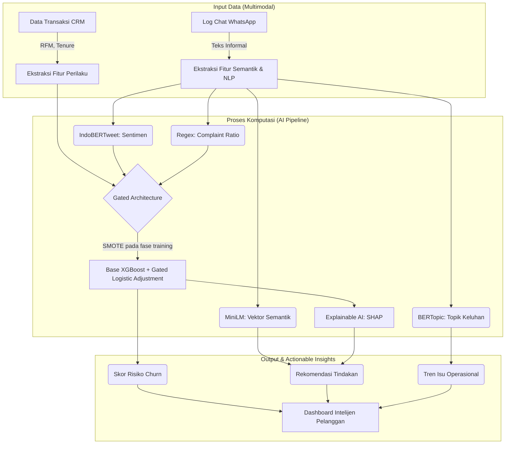

BAB II. LANDASAN TEORI

## 2.1 Evolusi Customer Intelligence dan Dinamika Churn pada Industri Jasa Non-Kontraktual
### 2.1.1 Pergeseran Paradigma dari Akuisisi Menuju Retensi
Lanskap ekonomi global pasca-pandemi telah mempertegas urgensi retensi pelanggan dibandingkan akuisisi. Aksioma bisnis klasik yang menyatakan bahwa biaya akuisisi pelanggan baru (Customer Acquisition Cost - CAC) dapat mencapai 5 hingga 25 kali lipat lebih tinggi dibandingkan biaya mempertahankan pelanggan eksisting (retention cost) tetap menjadi landasan valid, namun dengan nuansa baru yang didorong oleh saturasi pasar digital.3 Pada periode 2023-2025, tekanan inflasi dan ketidakpastian ekonomi makro memaksa perusahaan untuk memprioritaskan efisiensi modal, menjadikan Customer Lifetime Value (CLV) sebagai metrik "Bintang Utara" (North Star Metric) yang lebih kritikal dibandingkan pertumbuhan pengguna baru semata.

Dalam konteks industri jasa wellness dan ritel, loyalitas pelanggan tidak lagi bersifat biner (setia atau tidak), melainkan spektrum perilaku yang dipengaruhi oleh kepuasan pengalaman (experience satisfaction) dan keterikatan emosional. Riset yang dilakukan oleh Comlek (2025) pada pusat kesehatan dan kecantikan menyoroti bahwa kepercayaan (trust) dan personalisasi layanan berfungsi sebagai hambatan berpindah (switching barriers) yang efektif. Namun, kepercayaan ini bersifat rapuh; satu insiden layanan yang buruk yang tidak tertangani dapat memicu keputusan berhenti berlangganan secara instan. Oleh karena itu, kemampuan mendeteksi risiko churn secara dini menjadi kapabilitas defensif yang wajib dimiliki oleh entitas bisnis modern.

### 2.1.2 Taksonomi Churn: Kontraktual vs. Non-Kontraktual
Untuk membangun model prediksi yang akurat, pembedaan tegas antara contractual churn dan non-contractual churn merupakan prasyarat mutlak. Kegagalan dalam mengidentifikasi jenis hubungan ini sering kali menjadi penyebab utama rendahnya performa model prediktif dalam implementasi nyata.

**Tabel 2.1 Perbandingan Karakteristik Churn Kontraktual dan Non-Kontraktual**

| Dimensi Perbandingan | Pengaturan Kontraktual (Contractual Setting) | Pengaturan Non-Kontraktual (Non-Contractual Setting) |
|---|---|---|
| **Sektor Industri** | Telekomunikasi, SaaS (Software as a Service), Asuransi, Layanan Streaming (Netflix/Spotify). | Ritel (E-commerce, Toko Fisik), Layanan Jasa (Spa, Salon), Perhotelan, Aplikasi On-Demand. |
| **Definisi Churn** | Eksplisit & Deterministik. Pelanggan secara resmi membatalkan layanan atau tidak memperbarui kontrak pada tanggal jatuh tempo. Peristiwa churn tercatat sebagai kejadian diskrit dalam database. | Implisit & Probabilistik. Pelanggan tidak memiliki kewajiban untuk melapor saat berhenti. Churn adalah kondisi laten yang tidak dapat diamati secara langsung (*unobservable state*). |
| **Mekanisme Deteksi** | Pencatatan administratif (misal: "Status = Cancelled"). Analisis berfokus pada survival analysis hingga titik terminasi. | Inferensi perilaku. Deteksi didasarkan pada deviasi pola transaksi normal (misal: penurunan frekuensi belanja) atau jendela inaktivitas. |
| **Tantangan Utama** | Memprediksi kapan kontrak akan diputus (*Time-to-Event*). | Membedakan antara pelanggan yang sudah pergi (*defected*) dengan pelanggan yang hanya sedang "istirahat" (*dormant/inter-purchase gap*). |
| **Sumber Data Kunci** | Data penggunaan layanan (*usage logs*), status penagihan, riwayat tiket *support*. | Data transaksi (Recency, Frequency, Monetary), interaksi digital, sinyal media sosial. |
| **Literatur Terkait** | Hasumoto & Goto (2022); Burez & Van den Poel (2007). | Wachwanakijkul et al. (2025); Seymen et al. (2023); Mirkovic et al. (2022). |

### 2.1.3 Fenomena Silent Attrition (Atrisi Senyap)
Konsekuensi logis dari pengaturan non-kontraktual adalah fenomena Silent Attrition. Istilah ini, yang banyak dibahas dalam literatur perbankan dan ritel modern (2023-2025), merujuk pada erosi basis pelanggan yang terjadi secara diam-diam dan bertahap.10 Berbeda dengan pelanggan kontraktual yang mungkin mengajukan keluhan keras sebelum memutus layanan ("loud churn"), pelanggan non-kontraktual sering kali "menghilang begitu saja" (fade away).

Silent attrition sangat berbahaya karena sifatnya yang menipu (deceptive). Data agregat penjualan mungkin masih terlihat stabil karena adanya akuisisi pelanggan baru, padahal basis pelanggan setia sedang mengalami pengeroposan. Ketika penurunan pendapatan mulai terlihat dalam laporan keuangan, sering kali sudah terlambat untuk melakukan intervensi karena pelanggan tersebut mungkin sudah beralih ke kompetitor sejak 3-6 bulan sebelumnya. Penelitian oleh Aslan dan Asan (2021) serta studi lanjutan pada 2024 menunjukkan bahwa silent attrition sering didahului oleh sinyal-sinyal mikro (micro-signals) dalam pola interaksi non-transaksional, seperti penurunan intensitas komunikasi atau perubahan nada bicara dalam layanan pelanggan, sebelum transaksi benar-benar berhenti.

## 2.2 Metodologi Pendefinisian Churn pada Bisnis Transaksional
### 2.2.1 Pendekatan Jendela Inaktivitas (Time-Window Heuristic)
Untuk mengatasi kekakuan model probabilistik dan memungkinkan penggunaan algoritma Machine Learning modern (seperti XGBoost atau Neural Networks) yang membutuhkan label target yang jelas (0 atau 1), peneliti kontemporer (2021-2025) lebih memilih pendekatan Jendela Inaktivitas (Time-Window Inactivity) atau Cut-off Point.

Definisi operasional ini bekerja dengan menetapkan ambang batas waktu T (misalnya, 3 bulan atau 6 bulan).
* Jika $R_i = \text{Recency} > T$, maka pelanggan dilabeli sebagai **Churn** (1).
* Jika $R_i = \text{Recency} \le T$, maka pelanggan dilabeli sebagai **Aktif** (0).
Dalam konteks industri Baby Spa dan Wellness, di mana kunjungan sering kali bersifat bulanan atau triwulanan (mengikuti perkembangan bayi atau jadwal imunisasi), literatur menyarankan jendela inaktivitas antara 3 hingga 6 bulan sebagai representasi yang realistis dari siklus hidup pelanggan.
  
### 2.2.2 Rekayasa Fitur Perilaku dan Metodologi Temporal (Temporal Window)
Dalam memodelkan probabilitas perilaku pelanggan pada ekosistem layanan non-kontraktual, mendefinisikan batas waktu evaluasi fitur sama krusialnya dengan mendefinisikan label target. Mengekstraksi agregasi perilaku (seperti tren frekuensi atau metrik RFM) tanpa batasan temporal yang terisolasi dapat memicu *temporal data leakage*, yaitu kondisi di mana model secara tidak sengaja menggunakan informasi masa depan (setelah perilaku churn terjadi) untuk memprediksi probabilitas masa lalu.

Untuk mencegah distorsi tersebut, arsitektur pemodelan prediktif kontemporer mengadopsi kerangka kerja *Rolling-Window* (Mufti et al., 2026). Dalam kerangka ini, komputasi fitur perilaku maupun sentimen NLP dieksekusi secara ketat terbatas pada *Observation Window* (jendela pengamatan masa lalu, misalnya 90 hari terakhir) yang terpisah secara tegas dari *Prediction/Evaluation Window* di masa depan tempat insiden churn dievaluasi. Penerapan ini didukung oleh kesimpulan Simoes (2025) serta Noren (2026) yang menyoroti bahwa ekstraksi elemen RFM pada kasus non-kontraktual wajib mengisolasi jendela pengamatan tanpa tumpang-tindih (*non-overlapping*) guna menghasilkan estimasi risiko yang otentik.

Implementasi teknis rekayasa fitur ini dioperasionalisasi melalui metodologi *As-Of-Date* (tanggal acuan *snapshot*), sebuah standar evaluasi yang dipelopori oleh kerangka prediktif *Triage* dari *Data Science for Social Good* (DSSG). Metodologi ini menuntut mesin analitik untuk secara hipotetis "membekukan waktu" pada tanggal pelaporan tertentu; seluruh variabel prediktif ditarik mundur hanya berdasarkan rekam jejak yang tervalidasi tepat sebelum detik tanggal acuan tersebut. Literatur praktik industri analitik Big Data modern mengafirmasi bahwa penetapan *Snapshot Date* serta delimitasi *Observation Window* adalah dua pilar mutlak agar sistem tidak memamerkan metrik performa tinggi yang sekadar ilusi akademis (Koladilip, 2025; Lucid, 2026).

### 2.2.3 Model Analisis RFM (Recency, Frequency, Monetary)
Sebagai pilar ekstraksi fitur dari data transaksi, penelitian ini menggunakan model RFM yang secara luas diakui dalam literatur pemasaran kuantitatif. Model ini mengompresi kompleksitas riwayat transaksi pelanggan ke dalam tiga dimensi perilaku prediktif:
* **Recency (R)**: Mengukur seberapa baru (dalam hitungan hari) pelanggan terakhir kali bertransaksi. *Recency* umumnya merupakan prediktor *churn* paling kuat, karena absennya pelanggan dalam periode yang lama berkorelasi langsung dengan degradasi ikatan *brand* (Fader & Hardie, 2009).
* **Frequency (F)**: Mengukur total jumlah kedatangan pelanggan dalam rentang waktu pengamatan (*Observation Window*). Metrik ini mencerminkan loyalitas dan rutinitas konsumsi.
* **Monetary (M)**: Mengukur nilai uang agregat dari transaksi pelanggan. Metrik ini krusial sebagai proksi *Customer Lifetime Value* (CLV) yang menentukan prioritas alokasi dana retensi.

Dalam arsitektur penelitian ini, nilai RFM tidak sekadar dipakai secara absolut, melainkan diturunkan menjadi metrik volatilitas (seperti *frequency_trend* atau *recency_ratio*) guna menangkap sinyal penurunan aktivitas jauh sebelum pelanggan menyentuh batas *churn* final.

## 2.3 Transformasi Data Percakapan sebagai Leading Indicator
### 2.3.1 Data Transaksional sebagai Lagging Indicator
Data transaksional, yang diringkas dalam metrik RFM (Recency, Frequency, Monetary), secara fundamental adalah Lagging Indicator. Data ini mencatat sejarah; ia memberitahu kita apa yang sudah terjadi.
* Penurunan metrik *Frequency* adalah tanda bahwa pelanggan sudah mengurangi interaksinya.
* Peningkatan metrik *Recency* adalah tanda bahwa pelanggan sudah lama tidak datang.
Ketika sistem mendeteksi risiko churn hanya berdasarkan data transaksi (misalnya, saat Recency menyentuh angka 90 hari), sering kali keputusan psikologis pelanggan untuk meninggalkan layanan sudah terjadi jauh sebelumnya. Intervensi pada titik ini sering kali bersifat reaktif dan memiliki tingkat keberhasilan (win-back rate) yang rendah karena pelanggan mungkin sudah membentuk kebiasaan baru dengan kompetitor.

### 2.3.2 Data Teks dan Interaksi sebagai Leading Indicator
Sebaliknya, data tidak terstruktur (unstructured data) yang bersumber dari interaksi pelanggan, seperti log percakapan WhatsApp, transkrip panggilan, atau ulasan, berfungsi sebagai Leading Indicator. Data ini mengandung sinyal intensi, emosi, dan friksi yang mendahului tindakan transaksional.

Riset mutakhir tahun 2024 oleh Zhang & Luo serta studi industri dari Sturdy AI menyoroti bahwa:
* **Sinyal Sentimen Dini**: Ketidakpuasan pelanggan sering kali terekspresikan dalam bentuk keluhan halus, pertanyaan berulang tentang harga, atau nada bicara yang sinis (*negative sentiment*) dalam percakapan, berminggu-minggu sebelum pelanggan benar-benar berhenti bertransaksi.
* **Deteksi Friksi Operasional**: Analisis topik pada data teks dapat mengungkap masalah operasional (misalnya: "susah booking", "admin slow response", "tempat parkir penuh") yang menjadi akar penyebab churn. Informasi "Mengapa" (*Why*) ini tidak tersedia dalam data transaksi yang hanya mencatat "Apa" (*What*) dan "Kapan" (*When*).
Dengan demikian, hipotesis utama bab ini adalah bahwa sinyal percakapan WhatsApp dapat memperkaya estimasi risiko dan konteks penanganan pelanggan, terutama ketika sinyal tersebut tersedia secara tepercaya. Namun, kontribusinya terhadap skor risiko harus diuji secara bersyarat agar sistem tidak memaksakan fusi teks pada pelanggan yang tidak memiliki riwayat komunikasi memadai.

### 2.3.3 Tantangan Pemanfaatan Data WhatsApp
Meskipun potensial, data WhatsApp menghadirkan tantangan teknis yang signifikan. Berbeda dengan data ulasan di e-commerce yang terstruktur per produk, data WhatsApp bersifat sekuensial, informal, dan penuh noise. Karakteristik ini mencakup penggunaan bahasa gaul (slang), singkatan ekstrem, alih kode (code-mixing Indonesia-Inggris-Jawa), dan struktur kalimat yang tidak baku. Metode NLP tradisional berbasis kamus baku (formal dictionary-based) terbukti gagal menangani data jenis ini, sehingga diperlukan pendekatan berbasis Deep Learning yang lebih adaptif.

### 2.3.4 Identity Resolution dan Privacy-Preserving Record Linkage (PPRL)
Selain tantangan linguistik, penggabungan data interaksi WhatsApp dengan data transaksi kasir menimbulkan tantangan privasi yang fundamental. Nomor telepon yang bertindak sebagai kunci relasional (*relational key*) antar kedua basis data tersebut merupakan informasi identitas pribadi (*Personally Identifiable Information* - PII) yang sangat sensitif.

Mengacu pada standar perlindungan data global seperti *General Data Protection Regulation* (GDPR) Pasal 4(5) serta panduan teknis dari *European Union Agency for Cybersecurity* (ENISA), teknik pseudonimisasi adalah prasyarat mutlak atau *privacy-by-design* dalam arsitektur analitik modern (ENISA, 2026). Dalam sistem intelijen pelanggan yang dikembangkan, pemisahan secara tegas antara proses identifikasi pelanggan (*identity resolution*) dan ekstraksi informasi semantik (NLP) diterapkan melalui kerangka *Privacy-Preserving Record Linkage* (PPRL). Literatur terkait PPRL di domain integrasi data lintas platform (seperti proyek EUPID) menegaskan bahwa penggabungan basis data tidak boleh dilakukan dengan menggunakan PII mentah.

Sebagai implementasi teknis, pencocokan data (*data linkage*) dilakukan menggunakan algoritma *hashing* kriptografis deterministik (seperti SHA-256), yang sejalan dengan standar praktik terbaik industri, seperti panduan *Sensitive Data Protection* dari Google Cloud Platform (GCP). Fungsi *hash* kriptografis ini bekerja secara satu arah (mengubah nomor telepon menjadi teks acak tak terbaca), namun bersifat deterministik, sehingga nomor WhatsApp yang sama akan senantiasa menghasilkan nilai *hash* yang sama persis. Pendekatan arsitektural ini memastikan bahwa *Identity Graph* pelanggan tetap terbentuk secara utuh. Model analitik pada sistem (XGBoost) tetap mengetahui probabilitas churn dari "Pelanggan A" sekaligus mengetahui bahwa keluhan tersebut memang berasal dari "Pelanggan A", tanpa model maupun operator perlu mengetahui nomor telepon asli milik Pelanggan A. Pendekatan ini menjamin keandalan fusi data multimodal sekaligus memastikan kepatuhan sistem terhadap prinsip-prinsip etika privasi data.

## 2.4 Arsitektur NLP: Penanganan Bahasa Indonesia Informal
### 2.4.1 Normalisasi Teks dan Preprocessing Adaptif
Langkah pertama dan paling kritikal adalah pra-pemrosesan. Data teks mentah dari WhatsApp mengandung banyak elemen non-informatif (seperti timestamp, pesan sistem enkripsi) dan variasi ejaan yang ekstrem.
* **Normalisasi Slang (*Slang Normalization*)**: Bahasa Indonesia di media sosial memiliki variasi leksikal yang tinggi untuk satu kata. Contohnya, kata "tidak" bisa ditulis sebagai *gak, ngak, ga, g, kaga, ndak*. Tanpa normalisasi, model *machine learning* akan memperlakukan variasi ini sebagai entitas yang berbeda, yang memecah statistik frekuensi kata (*sparsity problem*). Penelitian menunjukkan bahwa penggunaan kamus normalisasi slang buatan sendiri atau berbasis komunitas (seperti `colloquial-indonesian-lexicon`) secara signifikan meningkatkan akurasi klasifikasi sentimen.
* **Case Folding & Cleaning**: Konversi teks menjadi huruf kecil dan penghapusan karakter non-alfanumerik (seperti emoji yang tidak relevan, tautan URL) untuk mengurangi dimensi fitur.

### 2.4.2 Pendekatan Berbasis Transformer
Era NLP modern didominasi oleh arsitektur Transformer yang diperkenalkan oleh Vaswani et al. (2017). Berbeda dengan model sekuensial sebelumnya (RNN/LSTM) yang memproses kata satu per satu, Transformer menggunakan mekanisme Self-Attention yang memungkinkannya memahami konteks seluruh kalimat sekaligus. Hal ini sangat penting untuk memahami makna kata yang ambigu dalam bahasa Indonesia (polisemi), di mana makna kata sangat bergantung pada kata-kata di sekitarnya.

### 2.4.3 IndoBERTweet
#### Arsitektur dan Domain Pre-training
IndoBERTweet adalah varian dari arsitektur BERT (Bidirectional Encoder Representations from Transformers) yang dilatih ulang (pre-trained) secara spesifik menggunakan korpus data Twitter Indonesia yang sangat besar (lebih dari 400 juta tweet). Penelitian oleh Koto et al. (2021) dan validasi lanjutan pada 2024-2025 menunjukkan bahwa model yang dilatih pada domain yang sama dengan data target (dalam hal ini: media sosial/percakapan informal) memiliki performa jauh lebih baik dibandingkan model yang dilatih pada teks formal (seperti Wikipedia/Berita).

#### Keunggulan Vokabular Spesifik
Keunggulan distingtif IndoBERTweet terletak pada inisialisasi kosa katanya. Model ini "mempelajari" bahasa gaul, singkatan, dan istilah internet Indonesia secara natif selama fase pelatihan.
* **Penanganan OOV (*Out-of-Vocabulary*)**: Model standar sering gagal mengenali kata seperti "mager", "gercep", atau "baper" dan memecahnya menjadi sub-kata yang tidak bermakna. IndoBERTweet mengenali token-token ini sebagai unit semantik yang utuh.
* **Kinerja Empiris**: Studi komparatif oleh Nugroho et al. (2024) pada tugas klasifikasi feedback mahasiswa (yang mirip dengan keluhan pelanggan) membuktikan bahwa IndoBERTweet mencapai F1-Score yang lebih tinggi (0.8462) dibandingkan IndoBERT (0.8243) dan mBERT (0.8230), menegaskan superioritasnya dalam menangani teks informal.

Dalam arsitektur sistem yang diusulkan, IndoBERTweet berfungsi sebagai model klasifikasi sentimen untuk mengubah pesan WhatsApp menjadi label sentimen dan skor valensi. Skor ini kemudian diagregasikan pada level pelanggan sebagai `avg_sentiment_score` dan `sentiment_trend`. Dengan demikian, IndoBERTweet tidak digunakan sebagai sumber embedding untuk pencarian kemiripan semantik; peran embedding tersebut ditangani oleh MiniLM.

### 2.4.4 MiniLM
#### Konsep Knowledge Distillation
MiniLM dikembangkan menggunakan teknik Knowledge Distillation, di mana sebuah model "Siswa" (Student) yang berukuran kecil dilatih untuk meniru distribusi probabilitas dan peta perhatian (attention maps) dari model "Guru" (Teacher) yang berukuran besar (seperti BERT-Large atau RoBERTa). Inovasi utama MiniLM adalah distilasi Self-Attention Relation, yang memungkinkan model kecil menangkap nuansa hubungan antar-kata seakurat model besar dengan jumlah parameter yang jauh lebih sedikit.

#### Performa Benchmark dan Relevansi Aplikasi
Berdasarkan Massive Textual Embedding Benchmark (MTEB) Leaderboard 2024, keluarga model MiniLM diakui sebagai salah satu pendekatan embedding yang efisien. Dalam implementasi sistem ini digunakan `paraphrase-multilingual-MiniLM-L12-v2` karena mendukung representasi multilingual dan menghasilkan embedding berdimensi 384:
* **Kecepatan**: Mampu memproses kalimat hingga 5 kali lebih cepat dibandingkan model MPNet atau BERT-Base, menjadikannya ideal untuk memproses volume chat yang besar secara harian.
* **Kualitas Representasi**: Vektor embedding dimensi 384 yang dihasilkan terbukti sangat efektif untuk tugas pengelompokan semantik (clustering) dan pencarian similaritas, melampaui metode statistik klasik seperti TF-IDF.

Dalam sistem ini, MiniLM memiliki peran ganda. Pertama, untuk mendukung modul BERTopic dalam mempercepat pembentukan klaster topik tanpa mengorbankan koherensi. Kedua, menghasilkan representasi vektor (embedding) yang disimpan di basis data pgvector untuk pencarian kemiripan semantik (semantic similarity search). Kemampuan ini krusial karena memungkinkan sistem secara otomatis menarik pesan historis pelanggan yang relevan (nearest messages) sebagai bukti operasional (evidence) di dalam modul rekomendasi.

### 2.4.5 BERTopic
#### Arsitektur Modular BERTopic
BERTopic berbeda dari pendahulunya karena menggunakan pendekatan modular berbasis klastering, bukan generatif probabilistik. Arsitekturnya terdiri dari tiga tahap utama yang dapat dikustomisasi:
* **Embedding Dokumen**: Mengonversi setiap pesan chat menjadi vektor numerik menggunakan Sentence Transformer berbasis MiniLM. Ini memungkinkan sistem menangkap kesamaan makna meskipun kata-katanya berbeda (misal: "mahal" dan "biaya tinggi" akan memiliki vektor yang berdekatan).
* **Reduksi Dimensi (UMAP)**: Algoritma *Uniform Manifold Approximation and Projection* (UMAP) digunakan untuk memadatkan vektor dimensi tinggi ke dimensi rendah agar struktur lokal dan global data tetap terjaga, memfasilitasi proses klastering.
* **Klastering Berbasis Kepadatan (HDBSCAN)**: Algoritma *Hierarchical Density-Based Spatial Clustering of Applications with Noise* (HDBSCAN) mengelompokkan pesan-pesan yang memiliki kemiripan semantik tinggi ke dalam klaster topik, sambil secara cerdas memisahkan *noise* (pesan yang tidak relevan).

#### c-TF-IDF untuk Representasi Topik
Inovasi kunci BERTopic adalah penggunaan c-TF-IDF (Class-based TF-IDF). Jika TF-IDF standar menghitung kepentingan kata dalam dokumen, c-TF-IDF menghitung kepentingan kata dalam sebuah klaster topik. Rumusnya membandingkan frekuensi kata dalam klaster tertentu terhadap frekuensi kata tersebut di seluruh klaster lain.

$$ W_{t,c} = tf_{t,c} \times \log\left(1 + \frac{A}{tf_t}\right) $$

Di mana $W_{t,c}$ adalah skor kata $t$ dalam kelas $c$. Metode ini dapat menghasilkan deskripsi topik yang berguna untuk membaca tema percakapan, tetapi label topik berbasis keyword mentah tetap perlu dipetakan ke label bisnis dan divalidasi manusia. Hal ini penting karena pada data percakapan pendek, kata sapaan, lokasi, atau filler percakapan dapat muncul sebagai keyword dominan meskipun belum tentu merepresentasikan intent operasional.

#### Superioritas pada Teks Pendek
Studi evaluasi tahun 2024-2025 secara konsisten menunjukkan bahwa BERTopic mengungguli LDA dan NMF dalam menganalisis data teks pendek seperti tweet atau chat review. Topik yang dihasilkan lebih stabil, beragam, dan secara akurat merefleksikan isu-isu spesifik pelanggan, menjadikannya alat yang ideal untuk visualisasi tren keluhan pada dashboard CI.

## 2.5 Penanganan Ketidakseimbangan Data dan Interpretasi Model
### 2.5.1 Masalah Ketidakseimbangan Kelas
Salah satu tantangan paling persisten dalam pemodelan prediksi churn adalah ketidakseimbangan kelas (class imbalance). Dalam kondisi bisnis yang normal, mayoritas pelanggan adalah pelanggan setia (kelas mayoritas), sementara pelanggan yang churn (kelas minoritas) jumlahnya jauh lebih sedikit. Rasio ketidakseimbangan ini bisa mencapai 1:10 atau bahkan 1:100.
Algoritma pembelajaran mesin standar biasanya dirancang untuk meminimalkan tingkat kesalahan global (accuracy). Akibatnya, pada data tidak seimbang, model cenderung menjadi bias ke arah kelas mayoritas. Model yang hanya mengoptimalkan akurasi global cenderung bias ke arah kelas mayoritas. Pada konteks behavioral risk scoring, bias ini berdampak pada rendahnya sensitivitas model terhadap pelanggan berisiko tinggi, model akan menghasilkan skor risiko yang secara sistematis underestimate untuk kelas minoritas, sehingga pelanggan yang sebenarnya berisiko justru tidak terprioritaskan dalam dashboard. Kegagalan ini tidak dapat diterima karena biaya kesalahan False Negative (kehilangan pelanggan berharga) jauh lebih tinggi daripada biaya False Positive (memberikan promosi retensi pada pelanggan setia).

### 2.5.2 SMOTE (Synthetic Minority Over-sampling Technique)
Untuk mengatasi masalah ini, teknik resampling data diterapkan sebelum proses pelatihan model. Synthetic Minority Over-sampling Technique (SMOTE), yang diperkenalkan oleh Chawla et al. (2002), adalah metode oversampling yang paling luas digunakan dalam literatur.
Berbeda dengan random oversampling sederhana yang hanya menduplikasi data minoritas (yang berisiko menyebabkan overfitting karena model hanya "menghafal" data duplikat), SMOTE menciptakan data sintetis baru yang masuk akal secara statistik.
Mekanisme Matematis:
SMOTE bekerja di ruang fitur (*feature space*) bukan di ruang data mentah. Untuk setiap sampel kelas minoritas $x_i$:
1. Identifikasi $k$ tetangga terdekatnya (*k-nearest neighbors*) dari kelas yang sama.
2. Pilih salah satu tetangga secara acak, misal $x_{zi}$.
3. Buat sampel sintetis baru $x_{new}$ pada garis lurus yang menghubungkan $x_i$ dan $x_{zi}$ menggunakan rumus interpolasi linier:

$$ x_{new} = x_i + \delta \cdot (x_{zi} - x_i) $$

di mana $\delta$ adalah bilangan acak antara 0 dan 1.
Dengan cara ini, SMOTE memperluas wilayah keputusan (decision boundary) kelas minoritas menjadi lebih umum. Penting untuk digarisbawahi bahwa dalam sistem analitik prediksi yang diajukan, SMOTE diimplementasikan secara eksklusif pada **fase pelatihan (model training phase)**. Data sintetis diciptakan murni agar model mampu memetakan pola minoritas (*churner*) tanpa *overfitting*. Setelah *base model* XGBoost optimal, model tersebut di-deploy ke fase produksi (inferensi harian) dan mengevaluasi transaksi asli pelanggan tanpa campur tangan data sintetis lagi.

### 2.5.3 Metrik Evaluasi untuk Data Tidak Seimbang (Imbalanced Metrics)
Karena distribusi kelas pada domain prediksi *churn* secara alamiah sangat timpang (jumlah pelanggan yang *churn* jauh lebih sedikit daripada pelanggan aktif), penggunaan metrik Akurasi (*Accuracy*) secara tunggal akan memicu *accuracy paradox*, yaitu ilusi metrik di mana model tampak cerdas hanya karena menebak mayoritas. Oleh karenanya, evaluasi wajib bertumpu pada *Confusion Matrix* dengan mengedepankan metrik spesifik:
* **Precision**: Rasio pelanggan yang benar-benar *churn* di antara semua pelanggan yang diprediksi *churn* oleh model. *Precision* yang tinggi akan menyelamatkan perusahaan dari pemborosan anggaran promosi retensi (*False Positive*).
* **Recall (Sensitivity)**: Proporsi pelanggan *churn* aktual yang berhasil diidentifikasi. Pada kasus pertahanan bisnis, *Recall* lazimnya mendapat bobot lebih tinggi karena kerugian kehilangan pelanggan berharga (*False Negative*) jauh melampaui biaya diskon retensi.
* **F1-Score**: Rerata harmonik antara *Precision* dan *Recall* yang menghasilkan indikator ekuilibrium bagi ketangguhan model.
* **AUC-PR (Area Under the Precision-Recall Curve)**: Berbeda dengan AUC-ROC konvensional yang bisa bersikap terlalu optimis pada *imbalanced data*, AUC-PR mengkalkulasi luas area kurva hanya pada kelas minoritas, menjadikannya standar baku emas (*gold standard*) yang lebih ketat dan realistis untuk kasus prediksi *churn*.

### 2.5.4 Explainable AI (XAI) dengan SHAP
Model prediksi yang akurat tidak cukup; manajemen membutuhkan alasan ("Why?"). Model kompleks seperti XGBoost atau Ensemble sering dianggap sebagai "kotak hitam" (black box). Untuk menjembatani kesenjangan interpretabilitas ini, metode SHAP (SHapley Additive exPlanations) digunakan.
Berakar dari Teori Permainan (Game Theory), SHAP menghitung kontribusi marginal setiap fitur terhadap prediksi akhir.
* **Global Interpretability**: Fitur numerik mana yang paling penting secara keseluruhan? Misalnya, apakah `recency_ratio`, tren frekuensi, atau `complaint_ratio` memiliki kontribusi besar terhadap keluaran model.
* **Local Interpretability**: Mengapa pelanggan A memperoleh skor risiko tinggi? Misalnya, SHAP dapat menunjukkan bahwa `recency_ratio` dan penurunan frekuensi transaksi memberikan kontribusi positif terhadap skor risiko. Pesan atau kata kunci percakapan tetap diperlakukan sebagai konteks semantik, bukan sebagai kontribusi SHAP langsung.
Penerapan SHAP memberikan transparansi yang dibutuhkan untuk pengambilan keputusan strategis yang dapat dipertanggungjawabkan.

## 2.6 Arsitektur Model Multimodal
### 2.6.1 XGBoost (Extreme Gradient Boosting)
XGBoost (Chen & Guestrin, 2016) adalah evolusi dari algoritma Gradient Boosting yang dirancang untuk kecepatan komputasi dan performa model yang optimal. Algoritma ini telah menjadi standar emas dalam kompetisi data sains (seperti Kaggle) karena kemenangannya yang konsisten pada dataset tabular.
Landasan Matematis: Berbeda dengan Random Forest yang membangun pohon independen, XGBoost membangun pohon aditif untuk meminimalkan fungsi tujuan (*objective function*) $\mathcal{L}$. Pada langkah ke-$t$, model menambahkan fungsi baru $f_t$ untuk memprediksi residual dari langkah sebelumnya:

$$ \hat{y}_i^{(t)} = \hat{y}_i^{(0)} + \sum_{k=1}^{t} f_k(x_i) $$

Inovasi utama XGBoost adalah penggunaan pendekatan ekspansi Taylor orde kedua pada fungsi kerugian (*loss function*). Fungsi tujuan yang dioptimalkan adalah:

$$ \mathcal{L}^{(t)} \approx \sum_{i=1}^{n} \left[ l(y_i, \hat{y}_i^{(t-1)}) + g_i f_t(x_i) + \frac{1}{2} h_i f_t^2(x_i) \right] + \Omega(f_t) $$

Di mana $g_i$ adalah gradien (turunan pertama) dan $h_i$ adalah hessian (turunan kedua) dari fungsi kerugian. Penggunaan Hessian memungkinkan konvergensi yang lebih cepat dan akurat ke titik minimum global dibandingkan Gradient Boosting biasa.
Regularisasi dan Fitur Lanjutan: Istilah regularisasi dalam persamaan di atas adalah komponen yang mengontrol kompleksitas pohon, termasuk jumlah daun dan bobot daun. XGBoost menerapkan regularisasi L1 (Lasso) dan L2 (Ridge) secara eksplisit, yang mencegah overfitting bahkan pada dataset yang kecil. Selain itu, XGBoost memiliki mekanisme sparsity-aware split finding, yaitu kemampuan otomatis untuk menangani nilai yang hilang (missing values) dengan mempelajari arah percabangan default yang optimal, sebuah fitur yang sangat berharga untuk data pelanggan yang seringkali tidak lengkap.
Dalam penelitian ini, XGBoost diposisikan sebagai model dasar tabular untuk menghasilkan skor risiko berbasis fitur perilaku transaksi. Integrasi sinyal komunikasi tidak dipaksakan langsung ke seluruh pelanggan, melainkan diuji melalui mekanisme penyesuaian logistik bersyarat (*gated logistic adjustment*) pada pelanggan yang memiliki riwayat komunikasi tepercaya.

### 2.6.2 Pergeseran ke Pendekatan Multimodal dan Arsitektur Fusi Bersyarat (Conditional Fusion)
Salah satu perkembangan paling signifikan dalam analitik prediktif adalah pergeseran dari analisis data tunggal (unimodal) menuju analisis data multimodal. Rudd et al. (2023) menunjukkan bahwa penggabungan data perilaku dan teks mampu meningkatkan akurasi prediksi secara dramatis dibandingkan model *baseline* bersumber tunggal. Namun, pendekatan fusi multimodal tradisional yang menggabungkan fitur dari berbagai sumber secara paksa mulai dikritisi, terutama ketika salah satu modalitas rentan terhadap ketidaklengkapan (seperti data percakapan pelanggan yang tidak selalu ada).

Untuk mengatasi kelemahan tersebut, paradigma kontemporer beralih pada mekanisme fusi bersyarat. Kunhoth et al. (2024-2026) memperkenalkan kerangka *Ensemble with Conditional Feature Fusion* (ECFF). Mereka membuktikan bahwa fusi fitur sekunder (seperti NLP) hanya boleh diaktifkan secara selektif apabila sebuah syarat ambang batas (*threshold*) skor keyakinan terpenuhi. Hal ini sejalan dengan mekanisme "gerbang filter ketersediaan" dalam penelitian ini, di mana penyertaan sinyal NLP secara permanen pada seluruh basis pelanggan dihindari; penyesuaian logistik (*logistic adjustment*) hanya diaktifkan jika metrik *coverage* (seperti riwayat interaksi) pelanggan memenuhi prasyarat.

Lebih jauh, Han et al. (2022) menawarkan pendekatan *Sparse Gating* pada tingkat per-individu (*sample-level*). Jika sebuah fitur modalitas dianggap tidak informatif untuk sampel tertentu, mekanisme gerbang berbobot nol (*zero-weight gate*) akan menekan kontribusi modalitas tersebut hingga hilang. Landasan ini menjadi basis arsitektural bagi fungsi penyesuaian dinamis dalam skripsi ini, di mana skor dasar XGBoost hanya dapat disesuaikan oleh fitur komunikasi tertentu apabila pelanggan memiliki sinyal komunikasi tepercaya dan kandidat penyesuaian lolos evaluasi performa. Jika syarat tersebut tidak terpenuhi, sistem tetap menggunakan skor dasar berbasis transaksi.

Sebagai perlindungan pamungkas, Zou et al. (2026) melalui arsitektur DEAR menyoroti bahaya pergeseran semantik (*semantic shift*) akibat ketiadaan data modalitas sekunder (seperti *missing text*). Mereka merancang gerbang berbasis keandalan yang secara paksa akan menutup jalur fusi silang-modal dan memindahkan keputusan algoritma pada mode *Conservative Unimodal Fallback* (mundur ke satu modalitas saja yang paling terpercaya). Hal ini memberikan justifikasi akademis absolut bagi penerapan arsitektur hibrida (*fail-closed*) di dalam sistem penelitian ini. Menutup saluran NLP dan secara konservatif membiarkan XGBoost tabular bekerja sendirian bagi pelanggan "diam" bukanlah kelemahan, melainkan bentuk implementasi *unimodal fallback* yang terbukti secara ilmiah mampu menjaga stabilitas keputusan prediksi.

## 2.7 Sistem Pendukung Keputusan (DSS) dan Desain Dashboard
### 2.7.1 Evolusi dan Komponen DSS
Sistem Pendukung Keputusan (DSS) adalah sistem informasi interaktif yang menyediakan informasi, pemodelan, dan manipulasi data untuk membantu pengambilan keputusan dalam situasi yang semi-terstruktur atau tidak terstruktur.17 Evolusi DSS dalam konteks manajemen pelanggan telah bergerak dari sistem pelaporan statis menuju sistem analitik preskriptif yang didukung AI.
Komponen utama DSS modern meliputi:
* **Manajemen Data (DBMS)**: Mengumpulkan dan mengintegrasikan data dari berbagai sumber (CRM, POS, WhatsApp).
* **Manajemen Model (MBMS)**: Menyimpan dan mengeksekusi model analitis (XGBoost, NLP pipelines).
* **Antarmuka Pengguna (Dashboard)**: Memvisualisasikan hasil analisis dalam bentuk yang mudah dipahami oleh pengambil keputusan.18
* **Basis Pengetahuan**: Menyimpan aturan bisnis dan heuristik untuk menghasilkan rekomendasi (misalnya, "Jika risiko > 80%, tawarkan diskon 20%").
### 2.7.2 Prinsip Desain Dashboard untuk Analitik Pelanggan
Dashboard bukan sekadar kumpulan grafik; ia adalah alat komunikasi visual yang harus dirancang dengan mempertimbangkan kognisi manusia. Efektivitas sebuah dashboard Early Warning System bergantung pada kemampuannya untuk mengurangi beban kognitif (cognitive load) dan memfasilitasi persepsi cepat.
#### Hierarki Visual dan Aturan 5 Detik
Prinsip utama desain dashboard adalah Hierarki Visual. Informasi paling kritis harus ditempatkan di posisi yang paling menonjol (biasanya kiri atas untuk pembaca kiri-ke-kanan) dan menggunakan ukuran atau warna yang kontras. Aturan 5 Detik menyatakan bahwa pengguna harus mampu menjawab pertanyaan bisnis utama (misalnya, "Apakah churn meningkat?") dalam waktu lima detik setelah melihat dashboard.

#### Kontekstualisasi Data
Angka yang berdiri sendiri seringkali tidak bermakna. Prinsip desain modern menekankan pentingnya konteks. Menampilkan "Tingkat Churn: 5%" kurang informatif dibandingkan "Tingkat Churn: 5% (naik 1% vs Bulan Lalu)". Penggunaan sparklines (grafik garis mini tanpa sumbu) di samping metrik utama sangat efektif untuk memberikan konteks tren historis tanpa memakan banyak ruang layar.

#### Interaktivitas dan Drill-Down
* **Strategic Layer**: Menampilkan KPI tingkat tinggi untuk eksekutif (misal: Total Risiko Pendapatan).
* **Analytical Layer**: Memungkinkan manajer untuk melakukan *drill-down* ke segmen tertentu (misal: Risiko Churn pada Pelanggan Baru vs Lama).
* **Operational Layer**: Menyediakan daftar detail pelanggan berisiko untuk tim layanan pelanggan agar dapat segera ditindaklanjuti.

### 2.7.3 Wawasan yang Dapat Ditindaklanjuti (Actionable Insights) dan Analitik Preskriptif
Istilah "wawasan" sering disalahartikan sebagai sekadar data atau informasi. Dalam literatur akademis dan praktis (2020-2025), Wawasan yang Dapat Ditindaklanjuti (Actionable Insight) didefinisikan sebagai temuan berbasis data yang secara langsung menginformasikan keputusan atau intervensi spesifik.
Sebuah wawasan dianggap "dapat ditindaklanjuti" jika memenuhi kerangka kerja berikut:
* **Alignment (Keselarasan)**: Terkait langsung dengan tujuan bisnis strategis (misal: retensi).
* **Context (Konteks)**: Menjelaskan "Mengapa" (misal: karena keluhan harga).
* **Relevance (Relevansi)**: Disampaikan kepada orang yang tepat pada waktu yang tepat.
* **Specificity (Spesifisitas)**: Menyarankan tindakan konkret, bukan sekadar observasi.

Integrasi Prescriptive Analytics dalam DSS memungkinkan sistem untuk tidak hanya memprediksi siapa yang akan churn, tetapi juga merekomendasikan apa yang harus dilakukan untuk mencegahnya (misal: "Tawarkan paket bundling untuk meningkatkan persepsi nilai").

Pendekatan modern dalam Sistem Pendukung Keputusan mensyaratkan integrasi analitik preskriptif secara otomatis. Gunjal et al. (2025) merancang arsitektur prediktif hibrida yang secara harfiah menggabungkan pemodelan *machine learning* dengan sistem rekomendasi heuristik berbasis aturan (*rule-based*). Mereka membuktikan bahwa analisis sentimen tidak seharusnya hanya dibatasi sebagai "fitur numerik tambahan" bagi algoritma, melainkan harus dioperasionalkan sebagai basis kebijakan rekomendasi tindak lanjut. Apabila modul mengekstraksi sentimen yang merepresentasikan umpan balik negatif, sistem berbasis aturan akan langsung memicu eskalasi perintah secara otomatis kepada admin. Landasan teoritis inilah yang mendasari perancangan operasional *Recommendation Policy v2* pada arsitektur penelitian ini, di mana suara pelanggan (*customer voice*) secara eksplisit menentukan tujuan (*objective*), kanal, dan kalimat pembuka pesan balasan.

Lebih lanjut, implementasi analitik preskriptif tidak boleh memukul rata semua segmen pelanggan. Shanmugam et al. (2026) mengkritisi model prediksi konvensional yang semata-mata bergantung pada metrik frekuensi transaksi karena model semacam itu luput menangkap disonansi psikologis pelanggan sebelum proses atrisi benar-benar terjadi. Melalui integrasi *Expectation-Confirmation Theory* (ECT) dan model NLP, mereka membuktikan bahwa intervensi yang disesuaikan per-segmen berdasarkan akar permasalahan secara emosional jauh lebih efektif mencegah churn ketimbang meluncurkan promosi diskon harga yang generik. Penelitian tersebut memberikan justifikasi absolut bahwa antarmuka dashboard tidak boleh berhenti pada penyajian skor probabilitas risiko; dashboard wajib secara dinamis menghidangkan saran mitigasi spesifik berdasarkan status transaksi dan muatan percakapan terkini dari pelanggan.

**Tabel 2.2 Matriks Perbandingan Penelitian Terdahulu**

| Peneliti (Tahun) | Fokus / Metode Utama | Temuan Kunci | Kontribusi pada Penelitian Ini |
|---|---|---|---|
| Gunjal et al. (2025) | Model Hibrida Prediksi & Rekomendasi | Sentimen suara pelanggan digunakan sebagai pemicu aturan heuristik otomatis untuk eskalasi layanan. | Landasan perancangan *Recommendation Policy v2* yang mengubah teks menjadi perintah tindak lanjut spesifik. |
| Shanmugam et al. (2026) | ECT & Prediksi Berbasis Segmen | Intervensi spesifik per-segmen berdasarkan sentimen psikologis jauh lebih efektif dari promosi generik. | Validasi akademis perlunya sistem rekomendasi mitigasi dinamis di dalam antarmuka *dashboard*. |
| Mufti et al. (2026) | Arsitektur *Rolling-Window* Churn | Ekstraksi fitur dan evaluasi target wajib dipisah menjadi *Observation* dan *Prediction Window* untuk mencegah *temporal leakage*. | Landasan metodologi ekstraksi agregasi perilaku (RFM) berbasis jendela waktu ke belakang. |
| DSSG / Ghani dkk. | Kerangka *Triage* & Metodologi *As-Of-Date* | "Membekukan waktu" pada tanggal *snapshot* mutlak diperlukan agar fitur hanya mengekstrak apa yang diketahui secara historis. | Justifikasi arsitektur *snapshot date* (as-of-date) pada *machine learning pipeline* sistem ini. |
| Koladilip (2025); Lucid (2026) | *Feature Engineering for Time-Based Churn* | Tanpa delimitasi *observation window* di basis data (BigQuery), metrik akurasi tinggi hanyalah ilusi dari kebocoran waktu. | Validasi praktik *feature engineering* level industri dalam mencegah kontaminasi data latih. |
| Simoes (2025); Noren (2026) | *Time-based Split & Cross-Validation* | Ekstraksi fitur transaksional non-kontraktual harus mematuhi *non-overlapping window*. | Pembuktian keabsahan algoritma kalkulasi metrik kelambanan/deviasi RFM yang diterapkan. |
| ENISA & Regulasi GDPR (2026) | Pseudonimisasi Lanjutan & Data Masking | Teknik pseudonimisasi adalah standar emas *privacy-by-design* untuk mematuhi regulasi privasi saat memproses PII. | Justifikasi perancangan sistem perlindungan privasi yang menyamarkan nomor telepon sebelum data diproses NLP. |
| GCP Guidelines & Literatur PPRL (EUPID) | Deterministic Hashing & PPRL | *Hashing* deterministik (misal: SHA-256) memungkinkan agregasi/penautan rekaman identitas secara utuh tanpa mengekspos data mentah. | Penjelasan teknis arsitektur *identity resolution* yang menggabungkan WhatsApp dan transaksi via *phone_hash*. |
| Imani et al. (2025) | Systematic Review Churn Prediction | Ensemble Learning adalah standar emas; isu interpretabilitas (explainability) masih menjadi tantangan utama. | Dasar pemilihan metode Ensemble dan fokus pada Explainable AI. |
| Kunhoth et al. (2024-2026) | Ensemble with Conditional Feature Fusion (ECFF) | Fusi fitur hanya boleh diaktifkan jika syarat ambang batas terpenuhi guna menghindari perusakan akurasi akibat data sekunder yang buruk. | Landasan "gerbang filter ketersediaan" (threshold coverage) sebelum fitur NLP digabungkan. |
| Zou et al. (2026) | Arsitektur DEAR & Conservative Unimodal Fallback | Memaksa fusi saat data hilang memicu *semantic shift*. Solusinya adalah *unimodal fallback* yang aman. | Validasi arsitektur hibrida *fail-closed*, mundur secara konservatif ke *base model* XGBoost bagi "silent majority". |
| Han et al. (2022) | Multimodal Dynamics & Sparse Gating | Menekan bobot kontribusi modalitas (hingga nol) pada tingkat *sample-level* jika data individu tidak informatif. | Dasar penggunaan *sparse gating* tingkat sampel dalam mematikan penyesuaian NLP secara individual. |
| Ardhani & Tania (2025) | XGBoost + SMOTE + SHAP | XGBoost dengan SMOTE efektif atasi imbalance; SHAP krusial untuk interpretasi bisnis. | Dasar metodologi penggunaan XGBoost sebagai *base model* untuk memproses data transaksi tabular. |
| Rudd et al. (2023) | Multimodal Fusion | Penggabungan data teks dan perilaku meningkatkan akurasi prediksi secara signifikan. | Landasan penggabungan sinyal transaksi dengan wawasan semantik (*customer voice*). |
| Hase et al. (2023) | WhatsApp NLP | Chat WhatsApp kaya akan sentimen jika diproses dengan NLP yang tepat. | Validasi penggunaan sumber data chat WhatsApp informal. |
| Wahyuni et al. (2025) | Topic Modeling (Indonesia) dengan BERTopic | BERTopic menghasilkan klaster topik yang lebih koheren pada teks pendek berbahasa Indonesia dibanding LDA. | Aplikasi *business intelligence* untuk mengekstraksi isu operasional (keluhan). |
| Indriani et al. (2024) | IndoBERTweet Performance | IndoBERTweet unggul menangani teks singkatan/slang khas Indonesia dibanding model BERT standar. | Pembenaran pemilihan IndoBERTweet sebagai sentimen analyzer untuk data chat. |
| Wang et al. (2024) | Efisiensi NLP (MiniLM) | MiniLM mencapai akurasi tinggi namun dengan kecepatan 2.7x lebih tinggi dan parameter lebih sedikit. | Aplikasi MiniLM sebagai ekstraktor fitur super ringan untuk efisiensi sistem *dashboard*. |
| Tan (2025) | Imbalanced Data | Penanganan *imbalance* wajib dilakukan untuk meningkatkan recall kelas minoritas. | Penguatan argumen penggunaan SMOTE pada tahap *training*. |

## 2.8 Kerangka Pemikiran

**Gambar 2.1 Diagram Kerangka Pemikiran**

Kerangka pemikiran penelitian ini dirancang untuk mentransformasi manajemen pelanggan di Mamina Baby Spa dari pendekatan yang bersifat reaktif menjadi proaktif berbasis data (data-driven customer intelligence). Pendekatan ini berangkat dari premis bahwa indikator risiko churn pada bisnis non-kontraktual tidak hanya tercermin dari data transaksi, tetapi juga dari pola interaksi pelanggan yang terekam dalam komunikasi sehari-hari, khususnya melalui WhatsApp:

### 2.8.1 Identifikasi Masalah (Problem Domain)
Permasalahan utama yang dihadapi manajemen adalah ketidakmampuan mendeteksi pelanggan yang berisiko churn secara dini. Pada konteks bisnis non-kontraktual, indikator berbasis transaksi (seperti penurunan frekuensi kunjungan) bersifat lagging indicator, karena hanya muncul setelah perilaku churn benar-benar terjadi.
Di sisi lain, percakapan WhatsApp pelanggan mengandung sinyal awal (*leading indicators*) berupa keluhan, ketidakpuasan, atau perubahan nada komunikasi. Namun, sinyal ini belum dimanfaatkan karena:
1. Volumenya besar,
2. Berbentuk data teks tidak terstruktur,
3. Dan sulit dianalisis secara manual.

### 2.8.2 Input Data (Sumber Data Multimodal)
Untuk menangkap sinyal churn secara lebih komprehensif, penelitian ini menggunakan pendekatan multimodal dengan dua sumber data utama:
* **Data Transaksional (Terstruktur)**: Riwayat kunjungan dan pembayaran pelanggan yang mencerminkan pola perilaku konsumsi.
* **Data Teks Interaksi WhatsApp (Tidak Terstruktur)**: Log percakapan pelanggan dengan admin yang merepresentasikan pengalaman, persepsi, dan respons emosional pelanggan terhadap layanan.
Kedua sumber data ini dipandang saling melengkapi, bukan saling menggantikan.

### 2.8.3 Proses Komputasi (AI/ML Pipeline)
Pemrosesan data dilakukan melalui beberapa jalur analitik yang memiliki fungsi berbeda namun terintegrasi dalam satu kerangka Customer Intelligence.
#### Jalur Pemrosesan Teks Interaksi
Setiap pesan WhatsApp diproses melalui tahapan ekstraksi fitur semantik dan modul NLP dengan peran yang berbeda:
* **Ekstraksi Fitur Berbasis Aturan Deterministik Kontekstual**: Digunakan untuk mendeteksi secara deterministik intensi keluhan (*complaint flag*) atau permintaan spesifik seperti *refund* dengan mempertimbangkan konteks layanan, form reservasi, konsultasi bayi/ASI, dan koordinasi jadwal. Hasil ekstraksi ini diagregasi menjadi metrik kuantitatif seperti *complaint_ratio*, yang mengukur intensitas keluhan pelanggan.
* **MiniLM (Sentence Embedding)**: Digunakan untuk menghasilkan representasi vektor berdimensi rendah (384-dimensi) yang disimpan di basis data vektor (pgvector). Representasi ini digunakan secara langsung untuk pencarian *semantic similarity*, menyediakan konteks percakapan (*nearest messages*) sebagai pendukung keputusan retensi.
* **IndoBERTweet (Sentiment Classification - Fine-tuned)**: Digunakan sebagai *supervised sentiment classifier* untuk mengklasifikasikan setiap pesan ke dalam label sentimen (positif, netral, negatif) dan skor valensi. Label serta skor sentimen disimpan pada level pesan, kemudian diagregasikan menjadi sentimen rata-rata (*avg_sentiment_score*) dan tren sentimen (*sentiment_trend*) untuk membaca perubahan iklim interaksi pelanggan.
* **BERTopic (Topic Modeling - Unsupervised)**: Digunakan untuk mengelompokkan pesan ke dalam tema interaksi secara otomatis tanpa pelabelan manual. Hasil pemodelan topik ini bersifat deskriptif dan eksploratif, bertujuan memberikan konteks isu dominan yang dibahas pelanggan, bukan sebagai fitur langsung untuk model prediksi.
#### Jalur Ekstraksi Fitur Perilaku Transaksional
Data transaksi diolah menjadi fitur perilaku yang mencakup dimensi statis dan dinamis. Dimensi statis meliputi fitur RFM (Recency, Frequency, Monetary) dan Tenure. Dimensi dinamis meliputi fitur deviasi terhadap baseline individu seperti recency_ratio dan frequency_trend, serta fitur volatilitas yang menangkap ketidakstabilan pola aktivitas pelanggan. Pendekatan ini memungkinkan model menangkap sinyal perubahan perilaku secara lebih dini dibandingkan nilai absolut semata.
#### Integrasi Fitur Transaksional dan Interaksi (Gated Architecture)
Fitur perilaku dari data transaksi diposisikan sebagai prediktor primer untuk membangun model dasar (*base model*) menggunakan XGBoost. Teknik SMOTE digunakan murni di fase pelatihan model dasar ini untuk menangani ketidakseimbangan kelas. 
Sinyal NLP seperti *complaint_ratio* dan tren sentimen tidak dimasukkan sembarangan, melainkan diintegrasikan menggunakan mekanisme *gated logistic adjustment*. Skor risiko dasar dari XGBoost akan disesuaikan secara logistik menggunakan fitur NLP **hanya jika** pelanggan memiliki riwayat interaksi yang kredibel dan memadai (lulus gerbang filter ketersediaan). Arsitektur hibrida (*fail-closed*) ini menjamin sistem tetap menghasilkan prediksi berbasis transaksi yang kokoh bagi kelompok pelanggan "diam" (silent majority).

### 2.8.4 Output Sistem (Decision Support)
Hasil analisis disajikan dalam bentuk Dashboard Intelijen Pelanggan yang berfungsi sebagai Decision Support System, dengan komponen utama:
* **Skor Risiko Churn**: Probabilitas pelanggan akan berhenti dalam jangka waktu tertentu.
* **Penjelasan Model (Explainable AI)**: Interpretasi kontribusi fitur terhadap prediksi risiko menggunakan nilai SHAP, sehingga keputusan tidak bersifat *black box*.
* **Tren Tema Interaksi**: Visualisasi topik percakapan pelanggan untuk membantu manajemen memahami konteks masalah yang sedang berkembang.

### 2.8.5 Dampak Bisnis (Business Outcome)
Dengan mengintegrasikan analitik prediktif dan deskriptif, sistem memungkinkan manajemen untuk:
1. Mengidentifikasi pelanggan berisiko secara lebih dini.
2. Memahami penyebab potensial churn.
3. Melakukan strategi retensi yang tepat sasaran sebelum pelanggan benar-benar berhenti menggunakan layanan (*silent attrition prevention*).
