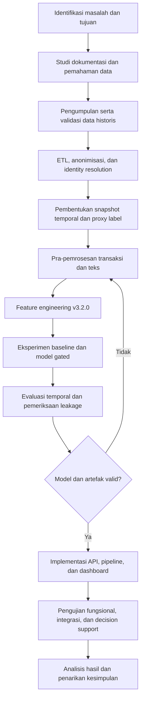
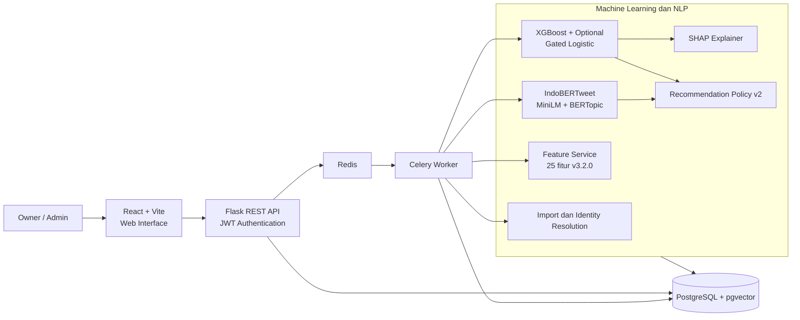

# BAB III. METODOLOGI PENELITIAN

## 3.1 Jenis dan Pendekatan Penelitian

Penelitian ini merupakan penelitian terapan (*applied research*) dengan pendekatan kuantitatif dan eksperimen komputasional. Penelitian diarahkan untuk menghasilkan solusi praktis berupa sistem pendukung keputusan yang dapat membantu Mamina Baby Spa & Pijat Laktasi memprioritaskan pelanggan berdasarkan risiko penurunan aktivitas.

Objek utama yang diuji adalah metode *behavioral risk scoring* pada bisnis non-kontraktual. Dalam konteks ini, pelanggan tidak menyatakan berhenti melalui pembatalan kontrak. Risiko harus diestimasi dari perubahan perilaku transaksi dan, apabila tersedia, interaksi WhatsApp yang identitasnya dapat dihubungkan secara tepercaya kepada pelanggan.

Penelitian memadukan tiga bentuk analisis:

1. **Analitik prediktif**, untuk mengestimasi skor risiko penurunan aktivitas pelanggan dalam rentang 0 sampai 1.
2. **Analitik deskriptif**, untuk merangkum pola transaksi, sentimen, keluhan, topik percakapan, dan perubahan aktivitas pelanggan.
3. **Analitik preskriptif terbatas**, untuk membentuk saran tindak lanjut berbasis aturan yang dapat ditelusuri dan tetap memerlukan keputusan manusia.

Model *machine learning* dan pengolahan data menjadi fokus eksperimen, sedangkan aplikasi web digunakan sebagai sarana implementasi, pengujian alur, penyajian hasil, dan dukungan keputusan. Sistem tidak dimaksudkan untuk menyatakan secara deterministik bahwa pelanggan telah berhenti dan tidak melakukan kontak otomatis kepada pelanggan.

## 3.2 Waktu dan Tempat Penelitian

Penelitian dilaksanakan pada Mamina Baby Spa & Pijat Laktasi sebagai lokasi pengambilan konteks bisnis dan sumber data operasional. Pengembangan, pemrosesan data, pelatihan model, dan pengujian sistem dilakukan pada lingkungan komputasi lokal peneliti dengan layanan yang dijalankan menggunakan kontainer Docker.

Periode pengembangan artefak penelitian berlangsung sejak Desember 2025 sampai Juni 2026. *Snapshot* akhir yang digunakan untuk pengujian implementasi, pelatihan ulang model, dan *risk scoring* dalam penelitian ini ditetapkan pada 30 Juni 2026. Data historis yang diolah mencakup profil pelanggan, transaksi, dan percakapan WhatsApp yang tersedia sebelum titik observasi masing-masing.

## 3.3 Objek, Subjek, dan Ruang Lingkup Penelitian

Objek penelitian adalah pola perilaku pelanggan yang direpresentasikan oleh riwayat transaksi dan interaksi WhatsApp. Subjek pengguna sistem terdiri atas pemilik atau manajemen dan admin operasional Mamina.

Ruang lingkup penelitian dibatasi sebagai berikut:

1. Analisis dilakukan pada bisnis jasa non-kontraktual.
2. Data utama terdiri atas profil pelanggan, transaksi layanan, dan ekspor percakapan WhatsApp.
3. Hanya pelanggan aktif, non-provisional, memiliki persetujuan penggunaan data, dan mempunyai transaksi selesai yang dapat masuk ke proses *risk scoring*.
4. Data percakapan hanya dapat diagregasikan ke pelanggan jika hasil *identity resolution* berstatus `verified` atau `probable` dan memenuhi batas kepercayaan yang ditetapkan.
5. Model menghasilkan skor risiko penurunan aktivitas, bukan kepastian churn.
6. Sistem dibangun sebagai aplikasi web dan belum diintegrasikan secara waktu nyata dengan ERP, POS, atau WhatsApp Business API.
7. Hasil rekomendasi merupakan dukungan keputusan. Persetujuan, penolakan, dan pelaksanaan tindakan tetap menjadi tanggung jawab pengguna.

## 3.4 Data Penelitian

### 3.4.1 Sumber dan Jenis Data

Penelitian menggunakan data sekunder retrospektif yang berasal dari data operasional internal. Jenis data dan atribut utamanya ditunjukkan pada Tabel 3.1.

**Tabel 3.1 Sumber Data Penelitian**

| No. | Data | Bentuk | Atribut Utama | Kegunaan |
|---|---|---|---|---|
| 1 | Profil pelanggan | CSV terstruktur | ID pelanggan, nama, nomor telepon, kota, tanggal bergabung, persetujuan, status pelanggan | Identitas, penyaringan pelanggan, dan penghubung antarsumber |
| 2 | Transaksi | CSV terstruktur | ID transaksi, ID pelanggan, tanggal, nominal, jenis layanan, status | Pembentukan fitur perilaku dan *proxy label* |
| 3 | Percakapan WhatsApp | TXT/CSV semi-terstruktur | Nomor telepon, waktu pesan, arah pesan, isi pesan | Sentimen, keluhan, pola komunikasi, topik, dan bukti semantik |

Unit analisis model adalah satu pasangan pelanggan dan tanggal observasi (*customer-observation snapshot*), bukan hanya satu pelanggan. Dengan desain panel ini, pelanggan yang sama dapat muncul pada beberapa tanggal observasi selama seluruh fitur dan label dihitung sesuai batas waktu masing-masing.

### 3.4.2 Populasi dan Teknik Penentuan Sampel

Populasi penelitian adalah seluruh catatan pelanggan, transaksi, dan percakapan yang tersedia pada *snapshot* basis data penelitian. Komposisinya terdiri atas 3.137 profil, 9.440 transaksi selesai dari 2.423 pelanggan, dan 25.346 pesan WhatsApp. Dari seluruh profil, 358 merupakan pelanggan provisional. Proses *identity resolution* menghasilkan 11.993 pesan tepercaya yang terhubung ke 109 pelanggan.

Penelitian menggunakan *total sampling* terhadap catatan operasional yang memenuhi kriteria kelayakan, bukan pengambilan sampel responden secara acak. Untuk model risiko, kriteria inklusinya adalah pelanggan aktif, non-provisional, memiliki persetujuan, dan mempunyai transaksi selesai sebelum tanggal observasi. Untuk fitur komunikasi, kriteria tambahan berupa pesan masuk dengan tautan identitas tepercaya dan `match_confidence` minimal 0,7. Observasi yang tidak memenuhi kriteria tetap dapat disimpan untuk kebutuhan administratif, tetapi tidak digunakan sebagai masukan model.

### 3.4.3 Teknik Pengumpulan Data

Pengumpulan data dilakukan dengan teknik berikut:

1. **Studi dokumentasi**, yaitu mempelajari struktur data pelanggan, transaksi, ekspor WhatsApp, kebutuhan sistem, dan proses bisnis yang relevan.
2. **Ekstraksi data historis**, yaitu menyalin data operasional ke berkas impor tanpa mengubah data sumber.
3. **Observasi proses sistem**, yaitu mengamati alur impor, penghubungan identitas, pemrosesan NLP, pembentukan fitur, inferensi, dan penyajian hasil pada dashboard.

Data tidak diperoleh melalui eksperimen terhadap pelanggan. Penelitian juga tidak mengirim pesan atau perlakuan retensi secara otomatis. Oleh karena itu, pengujian rekomendasi pada penelitian ini berfokus pada ketepatan aturan, kelengkapan *provenance*, dan fungsi tinjauan admin, bukan pada pengukuran dampak kausal tindakan terhadap pelanggan.

### 3.4.4 Privasi dan Kelayakan Data

Nomor telepon dinormalisasi lalu disimpan dalam bentuk *hash* kriptografis (SHA-256) sebagai implementasi *Privacy-Preserving Record Linkage* (PPRL) untuk mengurangi paparan identitas pribadi. Data pelanggan provisional dipisahkan dari pelanggan terdaftar agar percakapan dari nomor yang belum dikenali tidak diasumsikan sebagai riwayat pelanggan tertentu. Hanya pelanggan dengan `consent_given=true` yang digunakan dalam pelatihan dan inferensi.

Kelayakan data diperiksa melalui:

1. validasi keberadaan kolom wajib;
2. validasi tipe data dan format tanggal;
3. pemeriksaan duplikasi;
4. pemeriksaan integritas relasi pelanggan dan transaksi;
5. normalisasi nomor telepon sebelum *matching*;
6. penyaringan transaksi dengan status selesai;
7. penyaringan tautan percakapan berdasarkan status dan tingkat kepercayaan; dan
8. pembatasan seluruh fitur berdasarkan tanggal observasi untuk mencegah kebocoran data masa depan.

## 3.5 Definisi Operasional Variabel

### 3.5.1 Behavioral Risk dan Proxy Label

Karena tidak terdapat kontrak yang dapat menunjukkan waktu churn secara eksplisit, variabel target dibentuk menggunakan *temporal proxy label*. Untuk tanggal observasi \(t_0\), label ditentukan dari keberadaan transaksi pada 90 hari sesudah \(t_0\):

\[
y_{i,t_0} =
\begin{cases}
1, & \text{jika pelanggan } i \text{ tidak bertransaksi pada } [t_0,t_0+90) \\
0, & \text{jika pelanggan } i \text{ bertransaksi pada } [t_0,t_0+90)
\end{cases}
\]

Nilai 1 diperlakukan sebagai sinyal risiko penurunan aktivitas, bukan bukti bahwa pelanggan secara permanen meninggalkan Mamina. Pelanggan dapat tidak aktif karena siklus usia anak, musim, kebutuhan layanan, atau faktor eksternal lain. Dengan demikian, luaran model disebut *behavioral risk score*.

### 3.5.2 Observation Window dan Prediction Window

Penelitian menggunakan dua jendela waktu:

1. **Observation window**, yaitu 90 hari sebelum tanggal observasi. Jendela ini dibagi menjadi tiga periode tidak tumpang tindih, masing-masing 30 hari, untuk membentuk fitur tren, magnitudo, dan volatilitas.
2. **Prediction window**, yaitu 90 hari setelah tanggal observasi. Jendela ini hanya digunakan untuk membentuk label dan tidak boleh digunakan sebagai sumber fitur.

Tanggal fitur ditetapkan satu hari sebelum tanggal awal *prediction window*. Tanggal observasi dibuat secara berkala sehingga membentuk beberapa *snapshot*. Tanggal observasi terakhir untuk data latih harus masih memiliki *prediction window* yang lengkap.

### 3.5.3 Skor dan Kategori Risiko

Model menghasilkan probabilitas kelas positif dalam rentang 0 sampai 1. Skor yang lebih tinggi menunjukkan prioritas pemantauan yang lebih tinggi. Sistem kemudian memetakan skor ke kategori *low*, *medium*, atau *high* menggunakan ambang yang disimpan dalam konfigurasi aplikasi. Analisis utama tetap menggunakan skor kontinu dan metrik pada beberapa ambang agar kesimpulan tidak bergantung pada satu batas kategorisasi.

## 3.6 Tahapan Penelitian

Tahapan penelitian mengadaptasi siklus analitik data yang terdiri atas pemahaman masalah, pemahaman data, persiapan data, pemodelan, evaluasi, dan implementasi. Alur penelitian ditunjukkan pada Gambar 3.1.

**Gambar 3.1 Diagram Alur Penelitian**



Uraian setiap tahap adalah sebagai berikut:

1. **Identifikasi masalah**, untuk merumuskan kebutuhan deteksi dini penurunan aktivitas dan kebutuhan pengguna.
2. **Pemahaman data**, untuk memeriksa struktur, periode, kelengkapan, dan hubungan antarsumber data.
3. **Persiapan data**, untuk melakukan validasi, pembersihan, penghubungan identitas, penyaringan data tepercaya, dan pembentukan *snapshot* temporal.
4. **Ekstraksi fitur**, untuk membentuk representasi perubahan perilaku transaksi dan sinyal komunikasi.
5. **Pemodelan**, untuk membandingkan baseline transaksi dengan rancangan integrasi sinyal komunikasi yang bersifat gated.
6. **Evaluasi**, untuk menilai kemampuan ranking, ketepatan klasifikasi, sensitivitas ambang, dan keamanan temporal.
7. **Implementasi sistem**, untuk menyajikan skor, penjelasan, konteks percakapan, dan rekomendasi melalui aplikasi web.
8. **Pengujian sistem**, untuk memastikan fungsi, integrasi, konsistensi artefak, dan penyajian hasil berjalan sesuai rancangan.

## 3.7 Metode Pengolahan Data

### 3.7.1 ETL dan Identity Resolution

Tahap ETL (*extract, transform, load*) memuat profil pelanggan, transaksi, dan percakapan ke PostgreSQL. Setiap berkas terlebih dahulu melalui validasi skema dan pratinjau impor. Data yang lolos validasi dinormalisasi dan disimpan sesuai lapisannya: data mentah, hasil penghubungan identitas, fitur, semantik, dan luaran model.

Percakapan WhatsApp pada awalnya hanya mempunyai nomor telepon. Sistem menormalisasi format nomor, membentuk *hash* kriptografis deterministik (SHA-256), lalu mencocokkannya dengan profil pelanggan. Hasil pencocokan disimpan bersama `link_status` dan `match_confidence`. Agregasi fitur komunikasi hanya menggunakan pesan masuk dari pelanggan yang mempunyai tautan tepercaya. Pemisahan ini mencegah kontaminasi fitur oleh pesan admin, calon pelanggan provisional, atau hubungan identitas yang ambigu.

### 3.7.2 Pra-Pemrosesan Data Transaksi

Pra-pemrosesan transaksi meliputi:

1. memilih transaksi berstatus `completed`;
2. menghapus atau mengabaikan duplikasi berdasarkan identitas transaksi;
3. mengonversi waktu transaksi ke format waktu yang seragam;
4. membatasi transaksi hingga `as_of_date`;
5. mempertahankan transaksi bernilai nol sebagai sinyal kualitas data tersendiri, bukan langsung menghapusnya;
6. menyeragamkan jenis layanan untuk membedakan layanan reguler dan *homecare*; dan
7. menangani nilai kosong numerik menggunakan imputasi median yang dipelajari hanya dari data latih.

### 3.7.3 Pra-Pemrosesan Teks

Pra-pemrosesan teks dilakukan secara terbatas agar konteks bahasa informal tetap terjaga. Tahapannya mencakup pembersihan format ekspor WhatsApp, URL, spasi berlebih, dan karakter sistem; normalisasi bentuk bahasa informal yang terpilih; serta pemisahan arah pesan pelanggan dan admin.

Pemrosesan selanjutnya terdiri atas:

1. **Deteksi keluhan berbasis aturan kontekstual**, menggunakan filter deterministik yang membedakan komplain layanan dari form reservasi, konsultasi bayi/ASI, dan koordinasi jadwal.
2. **Analisis sentimen**, menggunakan checkpoint IndoBERTweet `Aardiiiiy/indobertweet-base-Indonesian-sentiment-analysis`. Nilai valensi dihitung sebagai probabilitas positif dikurangi probabilitas negatif. Hasil klasifikasi disimpan pada level pesan sebagai `sentiment_label` dan `sentiment_score`, kemudian diagregasikan pada level customer-window untuk menghasilkan `avg_sentiment_score` dan `sentiment_trend`.
3. **Embedding MiniLM**, menggunakan `paraphrase-multilingual-MiniLM-L12-v2` dengan keluaran 384 dimensi.
4. **Topic modeling**, menggunakan BERTopic dengan MiniLM, UMAP, HDBSCAN, dan representasi kata berbasis *CountVectorizer*.

Embedding tidak digunakan langsung sebagai fitur XGBoost. Embedding disimpan pada PostgreSQL dengan pgvector untuk kebutuhan BERTopic dan pencarian pesan yang mirip secara semantik. Topik BERTopic bersifat eksploratif dan digunakan sebagai konteks dashboard serta rekomendasi, bukan sebagai target berlabel atau penyebab matematis skor risiko.

### 3.7.4 Feature Engineering

Feature engineering menggunakan skema v3.2.0 yang terdiri atas 25 fitur. Seluruh fitur dihitung terhadap `as_of_date`, sehingga transaksi atau pesan setelah tanggal tersebut tidak dapat masuk ke vektor fitur. Daftar fitur ditunjukkan pada Tabel 3.2.

**Tabel 3.2 Fitur Behavioral Risk Scoring v3.2.0**

| Kelompok | Fitur | Deskripsi Ringkas |
|---|---|---|
| Tren | `recency_ratio` | Recency aktual dibandingkan rata-rata jarak transaksi personal |
| Tren | `frequency_trend_smoothed` | Kemiringan tren frekuensi transaksi setelah smoothing |
| Tren | `spend_trend_smoothed` | Kemiringan tren belanja setelah smoothing |
| Tren komunikasi | `msg_trend_smoothed` | Kemiringan tren jumlah pesan setelah smoothing |
| Tren komunikasi | `sentiment_trend` | Perubahan sentimen 30 hari terbaru terhadap periode sebelumnya |
| Konteks | `recency_days` | Hari sejak transaksi selesai terakhir |
| Konteks | `tx_count_90d` | Jumlah transaksi selesai dalam 90 hari |
| Konteks | `spend_90d` | Total belanja dalam 90 hari |
| Konteks | `avg_tx_value` | Rata-rata nilai transaksi dalam 90 hari |
| Konteks | `tenure_days` | Lama hubungan pelanggan hingga tanggal observasi |
| Magnitudo | `activity_mean` | Rata-rata jumlah transaksi pada tiga window |
| Magnitudo | `recent_activity_avg` | Aktivitas pada window 30 hari terbaru |
| Volatilitas | `activity_std` | Standar deviasi aktivitas antar-window |
| Volatilitas | `activity_cv` | Koefisien variasi aktivitas |
| Volatilitas | `spend_volatility_cv` | Koefisien variasi belanja |
| Interaksi | `trend_magnitude_interaction` | Interaksi tren frekuensi dan tingkat aktivitas |
| Komunikasi | `avg_sentiment_score` | Rata-rata valensi sentimen pesan pelanggan |
| Komunikasi | `complaint_ratio` | Proporsi pesan pelanggan yang terdeteksi sebagai keluhan |
| Komunikasi | `msg_volatility` | Standar deviasi jumlah pesan harian |
| Komunikasi | `response_delay_mean` | Rata-rata waktu respons admin |
| Gate | `has_communication_90d` | Penanda tersedianya pesan masuk tepercaya dalam 90 hari |
| Kanal | `homecare_tx_ratio_90d` | Proporsi transaksi homecare dalam 90 hari |
| Kanal | `last_tx_is_homecare` | Penanda bahwa transaksi terakhir adalah homecare |
| Kualitas data | `zero_amount_tx_count_90d` | Jumlah transaksi selesai bernilai nol |
| Lifetime | `lifetime_tx_count` | Jumlah transaksi selesai hingga tanggal observasi |

Tren dihitung dari tiga window berukuran 30 hari. Deret aktivitas dihaluskan menggunakan *Simple Moving Average* (SMA) dengan ukuran tiga periode sebelum kemiringan tren dihitung. SMA dipilih sebagai konfigurasi utama karena mudah dijelaskan dan mengurangi pengaruh fluktuasi jangka pendek. Implementasi juga menyediakan EMA sebagai opsi eksperimen.

Pendekatan deviasi personal digunakan pada `recency_ratio`:

\[
\text{recency\_ratio}_i =
\frac{\text{recency\_days}_i}
{\text{rata-rata interpurchase time}_i}
\]

Nilai tersebut membantu membedakan pelanggan yang memang mempunyai siklus kunjungan panjang dari pelanggan yang terlambat dibandingkan kebiasaannya sendiri. Fitur magnitudo tetap disertakan agar tren yang sama dapat ditafsirkan bersama tingkat aktivitas aktual. Koefisien variasi dibatasi untuk mencegah nilai ekstrem dan dibuat aman terhadap pembagian dengan nol.

## 3.8 Metode Pemodelan

### 3.8.1 Skenario Eksperimen

Eksperimen membandingkan dua representasi utama:

1. **Baseline transaksi**, menggunakan 18 fitur non-komunikasi. Model ini menjadi pembanding penelitian dan dapat digunakan pada seluruh pelanggan yang memenuhi syarat.
2. **Skema produksi gated**, menggunakan antarmuka 25 fitur. XGBoost berbasis transaksi selalu menghasilkan skor dasar. Penyesuaian menggunakan regresi logistik berregularisasi hanya dipertimbangkan bagi pelanggan yang memiliki komunikasi tepercaya.

Penelitian menguji apakah sinyal komunikasi memberikan peningkatan inkremental terhadap model transaksi. Sinyal komunikasi tidak dipaksakan masuk ke skor ketika cakupannya rendah. Nilai nol pada fitur komunikasi dapat berarti “tidak tersedia”, bukan “tidak ada keluhan” atau “sentimen netral”; karena itu, `has_communication_90d` digunakan sebagai *gate*.

Matriks untuk kandidat penyesuaian logistik terdiri atas skor dasar XGBoost, `complaint_ratio`, `msg_trend_smoothed`, dan transformasi logaritmik `response_delay_mean`. Kandidat hanya dapat diaktifkan apabila evaluasi terpisah pada kohort pelanggan dengan komunikasi menunjukkan kinerja yang tidak lebih buruk dari skor dasar sesuai toleransi yang ditetapkan. Jika syarat tidak terpenuhi, sistem bersifat *fail-closed* dan mempertahankan skor XGBoost transaksi.

### 3.8.2 Algoritma Model

XGBoost dipilih sebagai model dasar karena mampu menangani hubungan nonlinier pada data tabular, interaksi antarfitur, serta perbedaan skala fitur tanpa arsitektur *deep learning* khusus. Konfigurasi awal XGBoost menggunakan objektif `binary:logistic`, metrik pelatihan `logloss`, dan `random_state = 42` untuk menjaga reproduksibilitas. Nilai hyperparameter akhir tidak ditentukan pada tahap metodologi, melainkan dipilih melalui pengujian pada Bab V.

Hyperparameter tuning dilakukan secara konservatif menggunakan *validation split* temporal internal yang dibentuk dari data latih. Kandidat model dievaluasi dengan guardrail: ROC-AUC harus meningkat, PR-AUC tidak boleh turun secara material, serta F1 dan recall pada ambang operasional tidak boleh menurun melampaui toleransi. Dengan demikian, konfigurasi tidak dipilih hanya berdasarkan satu metrik tertinggi, tetapi berdasarkan kestabilan performa pada metrik ranking dan metrik klasifikasi.

Regresi logistik penyesuaian menggunakan standardisasi, regularisasi \(C=0,25\), `class_weight=balanced`, solver `liblinear`, dan maksimum 2.000 iterasi. Bentuk yang sederhana dan berregularisasi dipilih agar penyesuaian komunikasi lebih mudah dikendalikan pada kohort yang jauh lebih kecil daripada data transaksi.

### 3.8.3 Pembagian Data dan Pencegahan Leakage

Pembagian data dilakukan berdasarkan tanggal, bukan secara acak. Sekitar 20% tanggal observasi terbaru digunakan sebagai data uji. Baris data latih hanya dipertahankan jika seluruh *prediction window* 90 harinya berakhir sebelum tanggal awal data uji. Observasi di antara keduanya di-*purge*. Mekanisme ini mencegah label data latih menggunakan periode yang bertumpang tindih dengan periode evaluasi.

Untuk pelatihan penyesuaian logistik, skor dasar *out-of-fold* dibentuk menggunakan *GroupKFold* berdasarkan ID pelanggan. Evaluasi penyesuaian menggunakan *StratifiedGroupKFold* sehingga observasi pelanggan yang sama tidak tersebar secara bebas antara lipatan latih dan validasi.

Ketidakseimbangan kelas ditangani secara bersyarat. SMOTE hanya diterapkan pada data latih jika kelas positif berjumlah cukup dan proporsinya kurang dari 20%. Data uji tidak di-*oversampling*. Imputer juga hanya di-*fit* pada data latih. Prosedur tersebut mencegah informasi distribusi data uji masuk ke proses pelatihan.

Untuk eksperimen hyperparameter, data latih utama dipecah lagi menjadi *tuning train*, *purged gap*, dan *validation data*. *Tuning train* digunakan untuk melatih kandidat konfigurasi, sedangkan *validation data* digunakan untuk memilih kandidat sebelum diuji pada test split utama. Test split utama tidak digunakan untuk memilih konfigurasi agar evaluasi akhir tetap independen.

### 3.8.4 Artefak dan Reproduksibilitas

Pelatihan menghasilkan model, imputer, metadata nama fitur, versi skema, metrik, dan SHAP explainer. Setiap artefak diberi versi dan *hash*. Sebelum inferensi, sistem memeriksa urutan 25 fitur, jumlah fitur, *schema hash*, dan keterikatan SHAP terhadap model. Kandidat model tidak dipromosikan menjadi model aktif jika artefak wajib tidak lengkap atau tidak konsisten.

## 3.9 Strategi Evaluasi Model dan NLP

### 3.9.1 Evaluasi Model Risiko

Evaluasi dilakukan pada data uji temporal menggunakan:

1. **Precision**, untuk mengukur proporsi prediksi risiko yang tepat.
2. **Recall**, untuk mengukur proporsi pelanggan berlabel risiko yang berhasil ditemukan.
3. **F1-score**, untuk menyeimbangkan precision dan recall.
4. **ROC-AUC**, untuk mengukur kemampuan model mengurutkan kelas positif dan negatif pada seluruh ambang.
5. **PR-AUC**, untuk mengevaluasi hubungan precision-recall dan memberikan informasi yang lebih relevan ketika distribusi kelas tidak seimbang.
6. **Accuracy**, sebagai metrik pelengkap, bukan acuan tunggal.
7. **Threshold sensitivity**, dengan membandingkan precision, recall, F1-score, dan jumlah pelanggan berisiko pada beberapa ambang.

Perbandingan baseline dengan kandidat penyesuaian komunikasi dilakukan pada kohort yang sama-sama memiliki sinyal komunikasi. Cara ini mencegah kesimpulan peningkatan kinerja berasal dari perbedaan populasi evaluasi.

### 3.9.2 Evaluasi NLP dan Konteks Semantik

Analisis sentimen diperiksa melalui konsistensi pemetaan label model dan uji pada teks positif, netral, negatif, kosong, serta teks informal. Deteksi keluhan diuji terhadap kasus komplain layanan eksplisit, form reservasi dengan field keluhan, konsultasi bayi/ASI, serta pesan pelanggan yang hanya mengabarkan keterlambatan dirinya sendiri.

BERTopic dievaluasi menggunakan jumlah topik, *outlier rate*, *topic diversity*, dan *silhouette score*. Metrik tersebut digunakan sebagai indikator kualitas eksploratif, bukan sebagai bukti bahwa label topik merupakan kategori bisnis yang benar. Nama topik tidak langsung diambil dari keyword mentah, tetapi dipetakan ke label bisnis seperti Reservasi & Jadwal, Pendaftaran Member & Outlet, Homecare & Alamat, Baby Swim, Perawatan Tambahan, Harga/Promo/Pembayaran, dan Keluhan Keterlambatan Layanan. Walaupun demikian, nama dan kata kunci topik tetap memerlukan pemeriksaan manusia, terutama jika topik didominasi kata percakapan generik.

Pencarian kemiripan semantik diperiksa untuk memastikan embedding yang dibandingkan berasal dari versi model yang kompatibel. Hasil pesan terdekat diperlakukan sebagai bukti konteks percakapan dan tidak boleh dinarasikan sebagai kontribusi SHAP atau hubungan kausal.

## 3.10 Desain dan Perancangan Sistem

### 3.10.1 Arsitektur Sistem

Sistem dirancang menggunakan arsitektur *client-server* berlapis. React berfungsi sebagai antarmuka, Flask menyediakan REST API, Celery menjalankan proses berat secara asinkron, Redis menjadi *message broker*, dan PostgreSQL dengan pgvector menyimpan data relasional serta embedding. Arsitektur ditunjukkan pada Gambar 3.2.

**Gambar 3.2 Arsitektur Sistem yang Diusulkan**



Proses utama sistem dirancang modular:

1. impor dan penghubungan data;
2. pelatihan model topik;
3. pemrosesan NLP;
4. pembentukan fitur;
5. *risk scoring* dan pembuatan SHAP cache;
6. pembentukan rekomendasi;
7. pelatihan ulang model; dan
8. evaluasi model.

Setiap proses berat dikirim ke Celery agar API tetap responsif dan status pekerjaan dapat dipantau.

### 3.10.2 Desain Data

Desain data dibagi menjadi beberapa lapisan:

| Lapisan | Entitas Utama | Fungsi |
|---|---|---|
| Core | `customers`, `transactions`, `users` | Data utama pelanggan, transaksi, dan pengguna |
| Staging dan identity | `feedback_raw`, `feedback_linked` | Pesan mentah dan hasil penghubungan identitas |
| Feature | `feedback_features`, `customer_numeric_features`, `customer_text_signals` | Fitur per pesan dan snapshot pelanggan |
| Semantic | `customer_text_semantics`, `topics` | Sentimen, topik, kata kunci, dan konteks percakapan |
| Model output | `churn_predictions`, `shap_cache`, `ml_model_registry` | Skor, penjelasan, versi, dan provenance model |
| Decision support | `recommendation_contexts`, `actions` | Rekomendasi, hasil tinjauan, dan tindak lanjut |

Relasi berpusat pada pelanggan. Satu pelanggan dapat memiliki banyak transaksi, pesan terhubung, snapshot fitur, prediksi, penjelasan, rekomendasi, dan tindakan. Prediksi menyimpan *feature snapshot*, versi model, *model hash*, dan *schema hash* agar hasil dapat ditelusuri kembali.

### 3.10.3 Desain Antarmuka

Antarmuka dirancang untuk dua kelompok pengguna:

1. **Owner/manajemen**, yang membutuhkan ringkasan risiko, tren, pelanggan prioritas, penjelasan, dan rekomendasi.
2. **Admin operasional**, yang membutuhkan impor data, pemantauan pipeline, pengelolaan pelanggan, evaluasi model, dan pencatatan tindakan.

Halaman utama meliputi login, dashboard, daftar pelanggan, detail pelanggan, impor data, pipeline ML, evaluasi model, dan manajemen tindakan. Detail pelanggan memisahkan tiga jenis informasi: SHAP sebagai penjelasan output model, pesan/topik sebagai konteks semantik, dan Recommendation Policy v2 sebagai saran operasional. Pemisahan ini mencegah konteks percakapan disalahartikan sebagai penyebab matematis skor.

## 3.11 Rancangan Uji Coba Sistem

### 3.11.1 Pengujian Fungsional

Pengujian fungsional menggunakan metode *black-box*. Masukan, tindakan pengguna, keluaran yang diharapkan, keluaran aktual, dan status pengujian dicatat untuk setiap kebutuhan. Kelompok skenario ditunjukkan pada Tabel 3.3.

**Tabel 3.3 Rancangan Pengujian Fungsional**

| Kode | Modul | Fokus Pengujian |
|---|---|---|
| KF-01 | Import data | Berkas valid, kolom tidak lengkap, duplikasi, dan pratinjau |
| KF-02 | Identity resolution | Nomor cocok, nomor tidak dikenal, status tautan, dan trust filtering |
| KF-03 | NLP | Keluhan, sentimen, embedding, dan topic assignment |
| KF-04 | Feature engineering | Jumlah, urutan, nilai, dan temporal boundary fitur |
| KF-05 | Risk scoring | Rentang skor, label, eligibility, dan penyimpanan provenance |
| KF-06–KF-08 | Dashboard dan pelanggan | KPI, filter, detail, dan histori risiko |
| KF-09 | Explainability | Ketersediaan SHAP dan kesesuaian model/schema |
| KF-10 | Rekomendasi | Aturan transaksi, customer voice, fallback, dan review admin |
| KF-11 | Evaluasi model | Metrik, sensitivitas ambang, dan perbandingan model |
| KF-12 | Pipeline | Eksekusi modular, status Celery, dan penanganan kegagalan |
| KF-13 | Autentikasi | Kredensial valid/tidak valid dan proteksi endpoint |
| KF-14 | Manajemen tindakan | Pembuatan, perubahan status, dan histori tindak lanjut |

### 3.11.2 Pengujian Unit dan Integrasi

Pengujian otomatis backend menggunakan Pytest dan basis data uji terpisah. Pengujian mencakup layanan impor, fitur transaksi, sentimen, topic training, pembagian temporal, rekomendasi, serta kesesuaian skema training-inference. Frontend diuji menggunakan Vitest dan React Testing Library untuk komponen dan alur interaksi utama.

Pengujian integrasi memeriksa alur dari impor sampai dashboard:

```text
Import -> Linking -> NLP -> Feature Engineering -> Risk Scoring
       -> SHAP -> Recommendation -> Dashboard/Customer Detail
```

Kriteria keberhasilan meliputi tidak adanya data masa depan pada fitur, hanya pelanggan yang memenuhi syarat yang diberi skor, artefak model konsisten, pekerjaan asinkron selesai dengan status yang benar, dan output dapat diakses melalui API serta antarmuka.

### 3.11.3 Pengujian Model dan Artefak

Pengujian model mencakup:

1. pemeriksaan *purged temporal split*;
2. pemeriksaan bahwa imputasi dan SMOTE hanya dilakukan pada data latih;
3. perhitungan precision, recall, F1, ROC-AUC, dan PR-AUC;
4. analisis sensitivitas ambang;
5. perbandingan baseline dan gated adjustment pada kohort yang sama;
6. validasi 25 nama fitur dan *schema hash*;
7. pemeriksaan keterikatan SHAP terhadap model aktif; dan
8. uji *fail-closed* ketika model, metadata, atau SHAP tidak konsisten.

### 3.11.4 Pengujian Decision Support

Recommendation Policy v2 diuji pada kondisi transaksi seperti pelanggan baru, dormant, overdue, penurunan frekuensi, penurunan belanja, homecare, rutin, loyal, dan transaksi bernilai nol. Jika customer voice tersedia, pengujian juga mencakup konteks keluhan, reservasi, harga, layanan, dan lokasi.

Keluaran harus memuat tujuan, prioritas, waktu, kanal, contoh pembuka, *reason codes*, sumber rekomendasi, dan versi kebijakan. Admin harus dapat menerima atau menolak rekomendasi. Penelitian ini tidak mengukur efektivitas bisnis rekomendasi karena belum dilakukan eksperimen tindakan terkontrol terhadap pelanggan.

## 3.12 Alat dan Lingkungan Penelitian

Perangkat lunak yang digunakan ditunjukkan pada Tabel 3.4.

**Tabel 3.4 Perangkat Lunak Penelitian**

| Kelompok | Perangkat |
|---|---|
| Bahasa pemrograman | Python 3.10 dan JavaScript ES2022 |
| Backend | Flask 3.x, SQLAlchemy 2.x, Alembic |
| Frontend | React 18, Vite 5, React Query, Recharts, Tailwind CSS |
| Basis data | PostgreSQL 17 dan pgvector |
| Asynchronous processing | Celery 5 dan Redis 7 |
| Pengolahan data dan ML | Pandas, NumPy, Scikit-learn, Imbalanced-learn, XGBoost 2.x |
| NLP | Transformers, IndoBERTweet, Sentence Transformers, MiniLM, BERTopic, UMAP, HDBSCAN |
| Explainability | SHAP |
| Pengujian | Pytest, Pytest-Cov, Vitest, React Testing Library |
| Deployment lokal | Docker dan Docker Compose |
| Version control | Git |

Seluruh parameter penting, nama fitur, versi model, dan *hash* artefak disimpan untuk mendukung reproduksibilitas. Zona waktu aplikasi ditetapkan ke Asia/Jakarta agar batas waktu transaksi, pesan, dan pekerjaan terjadwal konsisten dengan konteks operasional.

## 3.13 Kriteria Keberhasilan Penelitian

Penelitian dinyatakan mencapai tujuan implementatif apabila:

1. data dari tiga sumber dapat diimpor, divalidasi, dan dihubungkan tanpa mencampurkan identitas yang tidak tepercaya;
2. fitur v3.2.0 dapat dihitung dengan batas temporal yang benar;
3. model menghasilkan skor kontinu dan metrik evaluasi temporal yang dapat direproduksi;
4. sinyal komunikasi hanya memengaruhi skor jika gate dan evaluasi peningkatan terpenuhi;
5. setiap prediksi dapat ditelusuri ke model, skema fitur, fitur masukan, dan penjelasnya;
6. dashboard menampilkan prioritas risiko, SHAP, konteks pelanggan, dan rekomendasi secara terpisah; dan
7. seluruh kebutuhan fungsional utama lulus pengujian *black-box* dan integrasi.

Kinerja model tidak dinilai hanya dari accuracy atau satu ambang. Keberhasilan ilmiah juga ditentukan oleh pencegahan *data leakage*, kejujuran terhadap keterbatasan cakupan teks, dan ketepatan interpretasi bahwa skor merupakan estimasi risiko penurunan aktivitas, bukan kepastian churn atau hubungan sebab-akibat.
