# 📘 Dokumentasi Sistem Prediksi Customer Churn - Mamina Baby Spa

## 📋 Daftar Isi

1. [Gambaran Umum Sistem](#1-gambaran-umum-sistem)
2. [Arsitektur Sistem](#2-arsitektur-sistem)
3. [Diagram Alur Data](#3-diagram-alur-data)
4. [Komponen Utama](#4-komponen-utama)
5. [Feature Engineering v3](#5-feature-engineering-v3)
6. [Alur Data Detail](#6-alur-data-detail)
7. [Struktur Database](#7-struktur-database)
8. [API Endpoints](#8-api-endpoints)
9. [Alur Proses Bisnis](#9-alur-proses-bisnis)

---

## 1. Gambaran Umum Sistem

Sistem ini adalah aplikasi **Behavioral Risk Scoring** untuk **Mamina Baby Spa & Pijat Laktasi**. Sistem menggunakan Machine Learning untuk memprediksi risiko disengagement customer berdasarkan **3 dimensi perilaku**: trend, magnitude, dan volatility.

### Fitur Utama:

- ✅ Prediksi risiko disengagement menggunakan XGBoost (20 features, v3.0.0)
- ✅ Smoothed trend features (SMA/EMA) untuk mengurangi noise
- ✅ Magnitude & volatility features untuk konteks aktivitas
- ✅ Interaction feature (trend × magnitude) untuk menangkap penurunan pada user aktif
- ✅ Explainability dengan SHAP values
- ✅ Temporal proxy labels (fitur dari masa lalu, label dari masa depan)
- ✅ ETL data dari WhatsApp chat logs
- ✅ Dashboard real-time untuk monitoring
- ✅ Configurable feature parameters via `FeatureConfig`

### Design Principles (Feature Engineering):

| Dimensi | Deskripsi | Contoh Feature |
|---|---|---|
| **Trend** | Arah perubahan aktivitas (smoothed) | `frequency_trend_smoothed`, `spend_trend_smoothed` |
| **Magnitude** | Tingkat aktivitas absolut & relatif | `activity_mean`, `recent_activity_avg` |
| **Volatility** | Stabilitas/konsistensi aktivitas | `activity_cv`, `spend_volatility_cv` |
| **Interaction** | Kombinasi trend × magnitude | `trend_magnitude_interaction` |

---

## 2. Arsitektur Sistem

### 2.1 Arsitektur High-Level

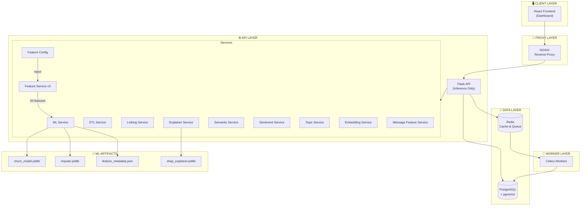

### 2.2 Tech Stack

| Layer           | Teknologi                              |
| --------------- | -------------------------------------- |
| Frontend        | React 18, Tailwind CSS, Vite           |
| Backend         | Flask, SQLAlchemy, Flasgger            |
| Database        | PostgreSQL + pgvector                  |
| Cache/Queue     | Redis                                  |
| Background Jobs | Celery                                 |
| ML              | XGBoost, SHAP, scikit-learn            |
| NLP             | IndoBERTweet (sentiment), MiniLM (embeddings) |
| Auth            | JWT (Flask-JWT-Extended)               |

---

## 3. Diagram Alur Data

### 3.1 Alur Data Utama (End-to-End)

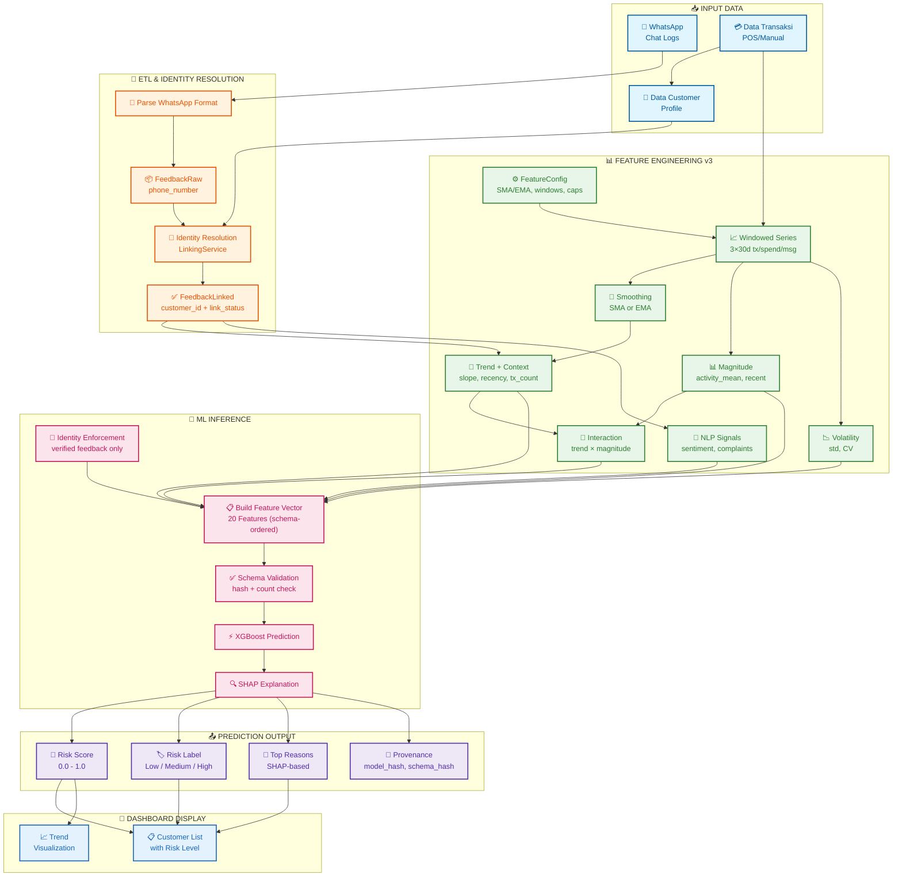

### 3.2 Alur ETL WhatsApp

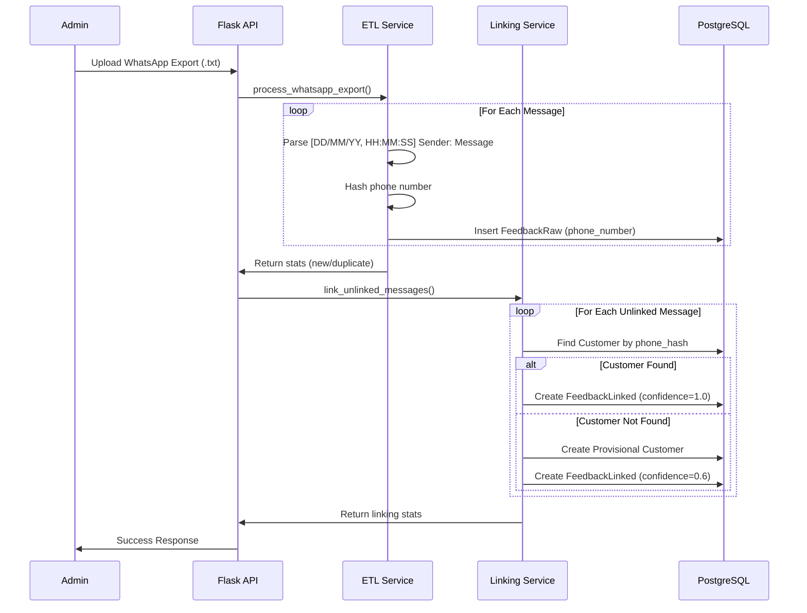

### 3.3 Alur Prediksi (v3 — Trust Boundary)

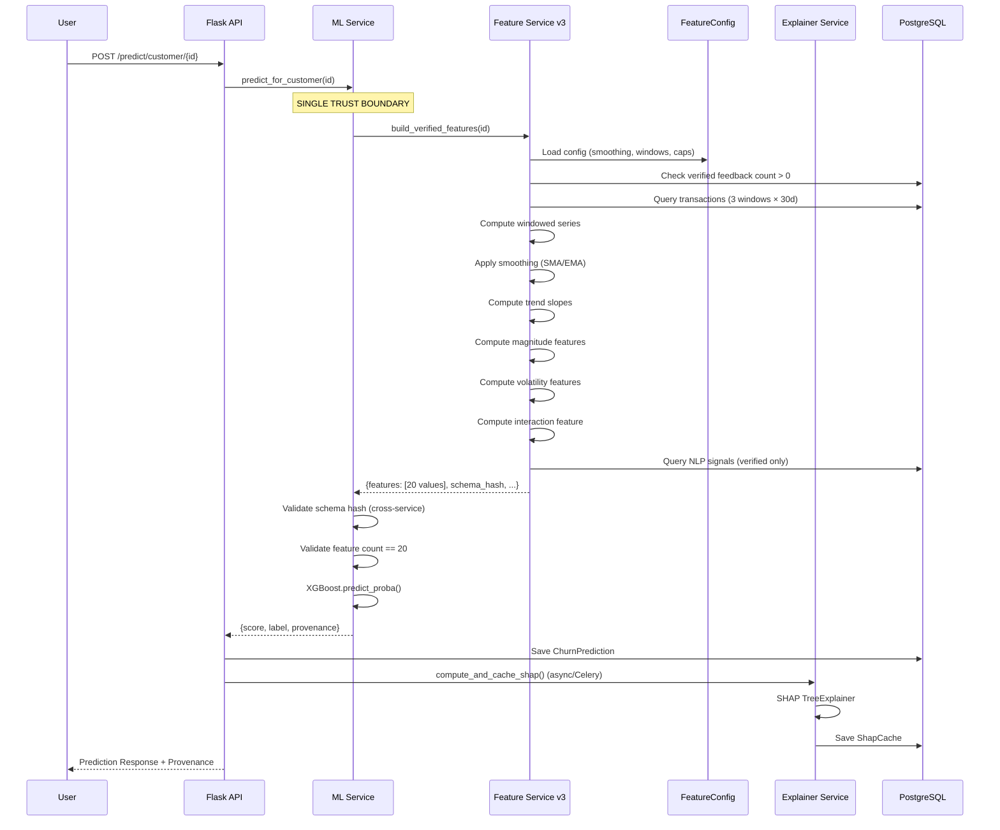

### 3.4 Alur Feature Engineering v3

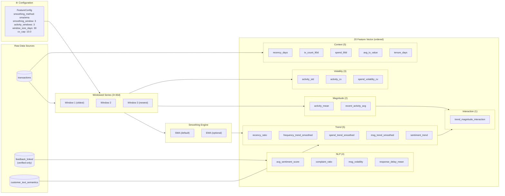

---

## 4. Komponen Utama

### 4.1 Backend Services

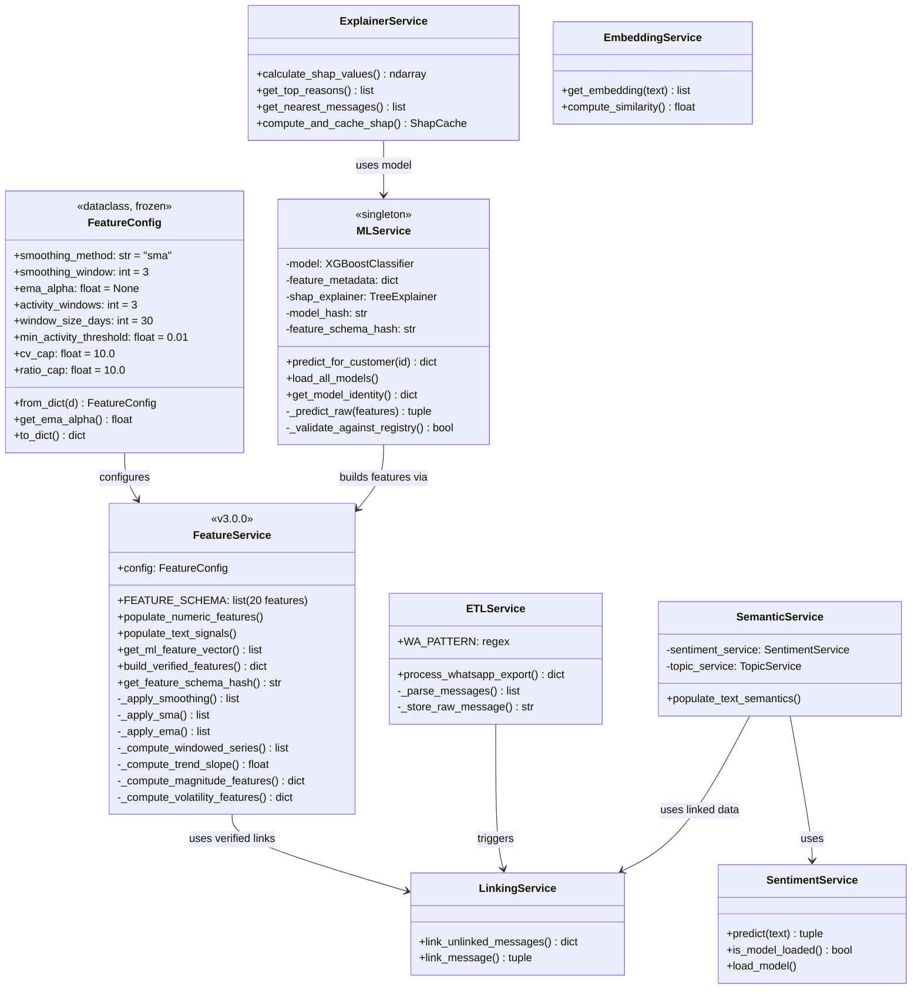

### 4.2 File Struktur Services

| File | Service | Deskripsi |
|---|---|---|
| `feature_config.py` | `FeatureConfig` | Structured config (frozen dataclass) untuk parameter feature engineering |
| `feature_service.py` | `FeatureService` | **Core**: Feature engineering v3 — smoothing, trend, magnitude, volatility |
| `ml_service.py` | `MLService` | Model loading, inference, provenance tracking (singleton) |
| `explainer_service.py` | `ExplainerService` | SHAP explanation + nearest message drilldown |
| `etl_service.py` | `ETLService` | WhatsApp chat log parsing & ingestion |
| `linking_service.py` | `LinkingService` | Identity resolution (phone → customer) |
| `semantic_service.py` | `SemanticService` | Orchestrator untuk sentiment & topic analysis |
| `sentiment_service.py` | `SentimentService` | IndoBERTweet sentiment analysis |
| `topic_service.py` | `TopicService` | Topic modeling |
| `embedding_service.py` | `EmbeddingService` | MiniLM text embeddings |
| `message_feature_service.py` | `MessageFeatureService` | Per-message feature extraction |

### 4.3 Scripts

| File | Deskripsi |
|---|---|
| `scripts/train_model.py` | Training script (v3 schema, 20 features) |
| `scripts/validate_features.py` | Feature validation / EDA utility |
| `scripts/seed_data.py` | Database seeding |
| `scripts/check_db.py` | Database health check |
| `scripts/verify_tables.py` | Table verification |

### 4.4 Notebooks & Dokumentasi

| File | Deskripsi |
|---|---|
| `notebooks/01_churn_model_training.ipynb` | Jupyter notebook untuk training model |
| `notebooks/TRAINING_NOTEBOOK_UPDATE_GUIDE.md` | Panduan cell-by-cell untuk training v3 |
| `notebooks/FEATURE_DOCUMENTATION_V3.md` | Dokumentasi lengkap per-feature (definisi, meaning, edge cases) |

### 4.5 Database Models

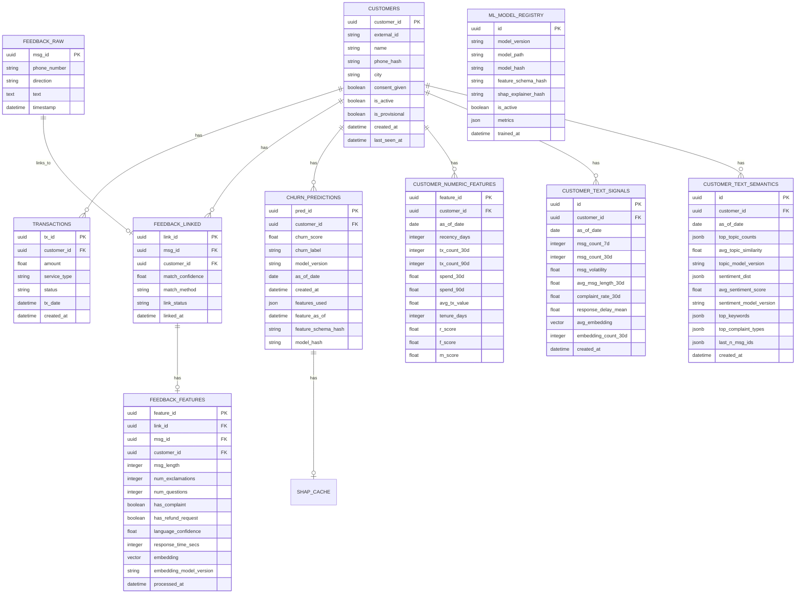

---

## 5. Feature Engineering v3

### 5.1 Feature Schema v3.0.0 (20 Features)

| # | Feature | Kategori | Formula | Behavioral Meaning |
|---|---|---|---|---|
| 1 | `recency_ratio` | Trend | recency_days / avg_ipt | Seberapa "telat" vs baseline personal |
| 2 | `frequency_trend_smoothed` | Trend | slope(SMA/EMA(tx_count per window)) | Arah perubahan frekuensi (de-noised) |
| 3 | `spend_trend_smoothed` | Trend | slope(SMA/EMA(spend per window)) | Arah perubahan belanja (de-noised) |
| 4 | `msg_trend_smoothed` | Trend | slope(SMA/EMA(msg_count per window)) | Arah perubahan komunikasi (de-noised) |
| 5 | `sentiment_trend` | Trend | sentiment_30d - sentiment_prior_30d | Perubahan sentimen |
| 6 | `recency_days` | Context | days since last tx | Absolute recency |
| 7 | `tx_count_90d` | Context | count(tx in 90d) | Absolute frekuensi |
| 8 | `spend_90d` | Context | sum(amount in 90d) | Absolute monetary |
| 9 | `avg_tx_value` | Context | spend_90d / tx_count_90d | Rata-rata belanja |
| 10 | `tenure_days` | Context | days since customer created | Lama jadi customer |
| 11 | `activity_mean` | Magnitude | mean(tx_count per window) | Tingkat aktivitas rata-rata |
| 12 | `recent_activity_avg` | Magnitude | tx_count di window terkini | Aktivitas terkini |
| 13 | `activity_std` | Volatility | std(tx_count per window) | Stabilitas frekuensi |
| 14 | `activity_cv` | Volatility | std/mean (capped, zero-safe) | Volatilitas relatif |
| 15 | `spend_volatility_cv` | Volatility | std(spend)/mean(spend) (capped) | Stabilitas belanja |
| 16 | `trend_magnitude_interaction` | Interaction | freq_trend_smoothed × activity_mean | Penurunan user aktif > user pasif |
| 17 | `avg_sentiment_score` | NLP | mean sentiment 30d | Sentimen rata-rata |
| 18 | `complaint_ratio` | NLP | complaint/total messages 30d | Rasio komplain |
| 19 | `msg_volatility` | NLP | std daily message count | Volatilitas pesan |
| 20 | `response_delay_mean` | NLP | mean admin response time | Waktu respon admin |

### 5.2 Smoothing

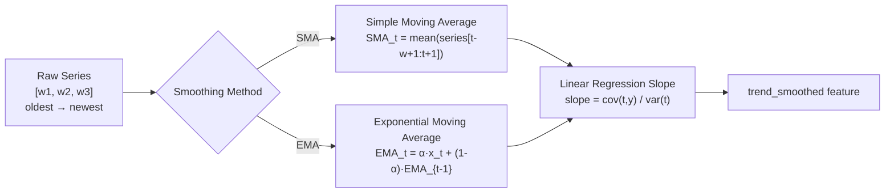

- **SMA** (default): Stabil, interpretable, bobot sama ke semua observasi
- **EMA** (optional): Lebih responsif terhadap perubahan terbaru

### 5.3 Configurable Parameters

| Parameter | Default | Deskripsi |
|---|---|---|
| `smoothing_method` | `"sma"` | Metode smoothing: `"sma"` atau `"ema"` |
| `smoothing_window` | `3` | Window size untuk SMA / span untuk EMA |
| `ema_alpha` | `None` (auto) | Alpha EMA. Jika None, dihitung = `2/(window+1)` |
| `activity_windows` | `3` | Jumlah window historis (×30d) |
| `window_size_days` | `30` | Ukuran setiap window (hari) |
| `min_activity_threshold` | `0.01` | Floor untuk denominator CV |
| `cv_cap` | `10.0` | Cap untuk coefficient of variation |
| `ratio_cap` | `10.0` | Cap untuk safe ratio |

**Penggunaan:**
```python
# Default (production)
svc = FeatureService()

# Eksperimen
svc = FeatureService(config=FeatureConfig(smoothing_method='ema', smoothing_window=5))

# Dari Flask config
config = FeatureConfig.from_dict(app.config.get('FEATURE_CONFIG', {}))
svc = FeatureService(config=config)
```

### 5.4 Edge Case Handling

| Situasi | Penanganan |
|---|---|
| Customer tanpa transaksi | `recency_days = 999`, series = [0,0,0], trend = 0 |
| Customer dengan 1 transaksi | `avg_ipt = 0` → `recency_ratio` = cap (10.0) |
| `activity_mean` ≈ 0 (dormant) | `activity_cv = 0.0` (bukan infinite — dormant ≠ volatile) |
| Division by zero pada CV | Jika mean < `min_activity_threshold` → CV = 0.0 |
| Tidak ada verified feedback | `PermissionError` — ML requires verified identity |
| Smoothed series length < 2 | slope = 0.0 |

### 5.5 Catatan tentang `activity_total`

`activity_total` (sum dari 3 windows × 30d) **TIDAK ditambahkan** karena secara semantik identik dengan `tx_count_90d` (3×30d = 90d). Menambahkannya akan redundan tanpa informasi baru.

---

## 6. Alur Data Detail

### 6.1 Data Flow Layers

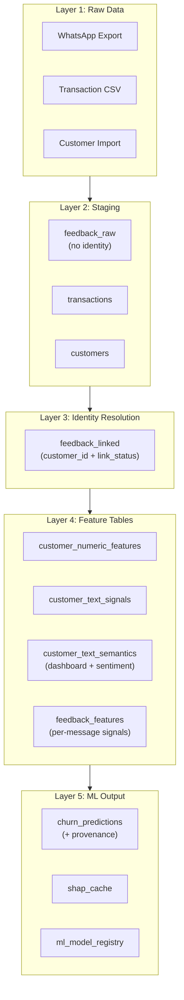

### 6.2 Identity Resolution Flow

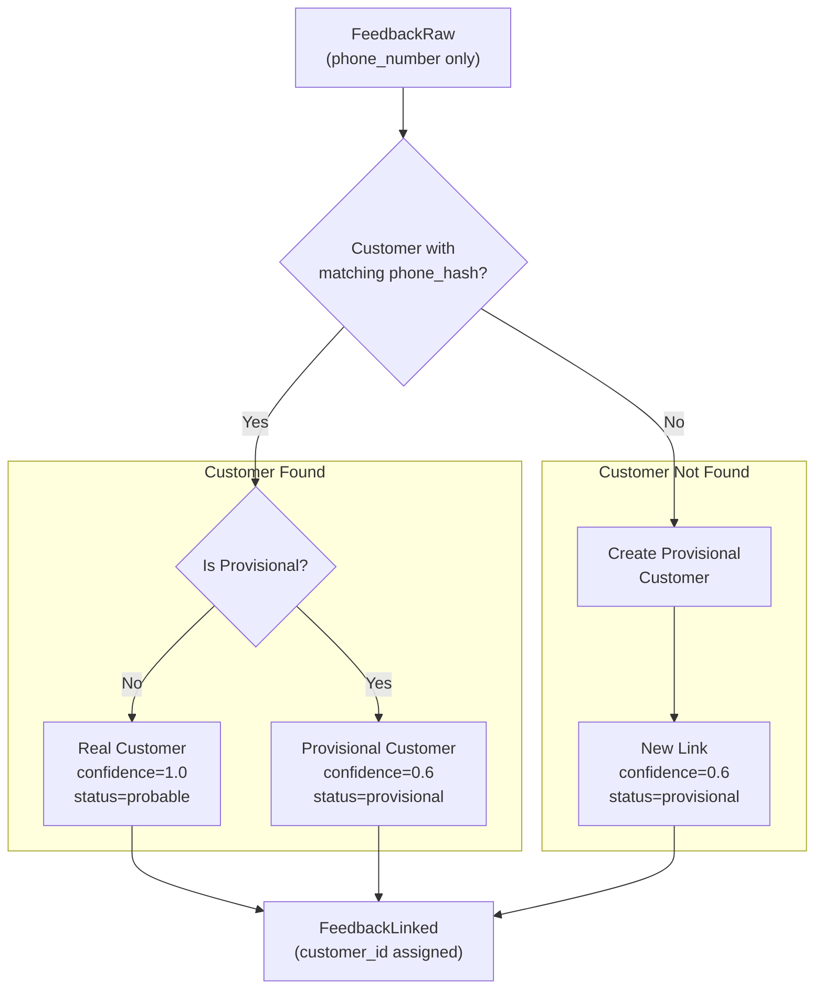

### 6.3 ML Pipeline Flow

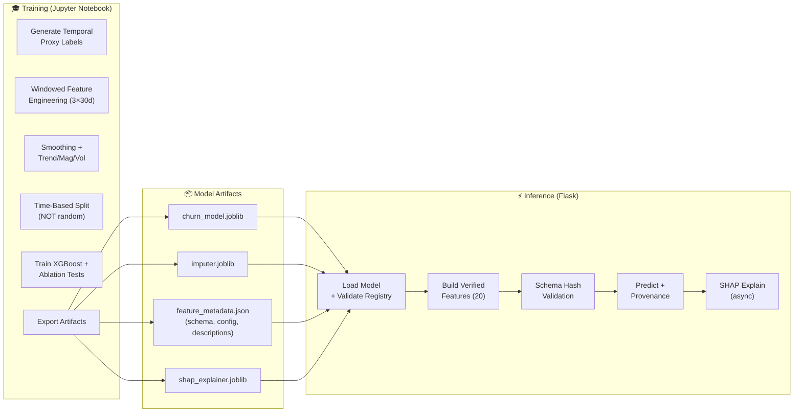

### 6.4 Training: Temporal Proxy Label

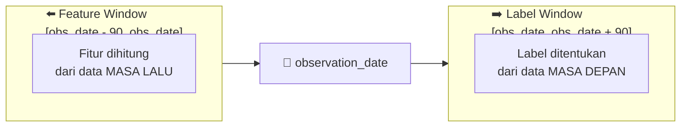

**Key Principle**: Fitur dan label menggunakan window yang **TIDAK overlap**, mencegah data leakage.

---

## 7. Struktur Database

### 7.1 Schema Overview

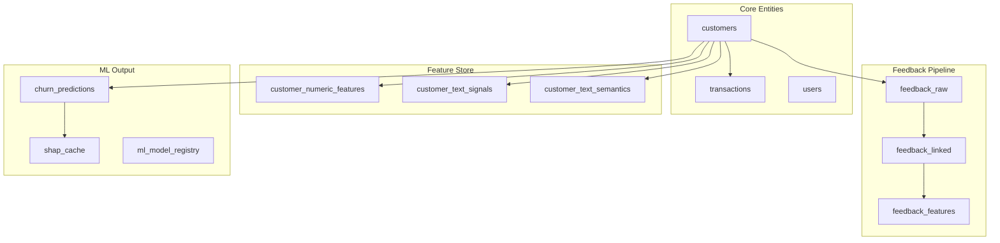

### 7.2 Tabel Utama

| Tabel | Deskripsi | Layer |
|---|---|---|
| `customers` | Data profil customer | Core |
| `transactions` | Riwayat transaksi (amount, status, tx_date) | Core |
| `users` | Admin/user akun untuk login | Core |
| `feedback_raw` | Pesan WhatsApp mentah (phone_number) | Staging |
| `feedback_linked` | Pesan yang sudah di-link ke customer (link_status) | Identity |
| `feedback_features` | Per-message ML features (complaint, sentiment, embedding) | Feature |
| `customer_numeric_features` | Base transaction signals (recency, tx_count, spend, RFM) | Feature |
| `customer_text_signals` | Text behavior signals (msg count, volatility, complaint rate) | Feature |
| `customer_text_semantics` | Semantic features (sentiment score, topic) — untuk dashboard | Display |
| `churn_predictions` | Hasil prediksi + provenance (model_hash, schema_hash) | ML Output |
| `shap_cache` | Cache SHAP values + nearest messages | ML Output |
| `ml_model_registry` | Registry model aktif (hash, metrics, version) | ML Output |

---

## 8. API Endpoints

### 8.1 Endpoint Overview

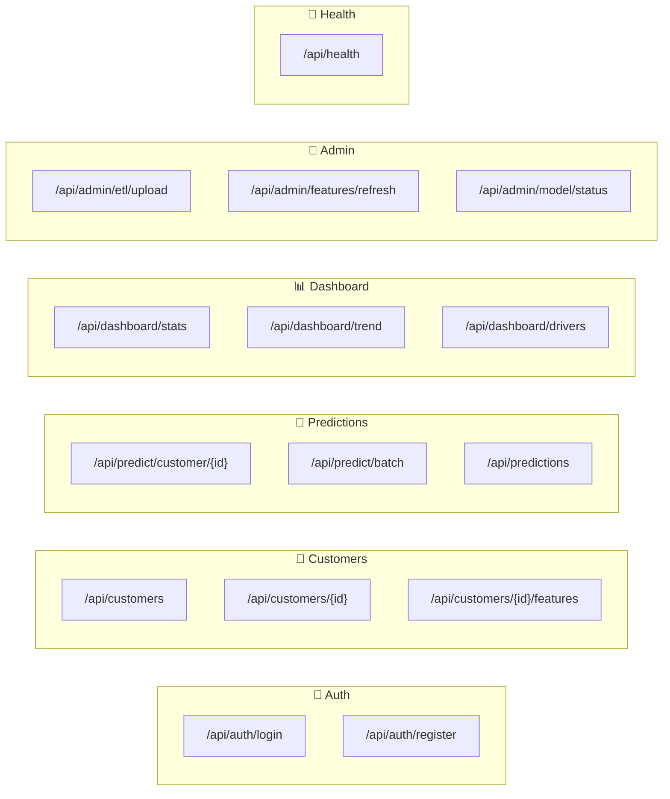

### 8.2 Endpoint Details

| Method | Endpoint | Deskripsi |
|---|---|---|
| POST | `/api/auth/login` | Login user |
| POST | `/api/auth/register` | Register admin user |
| GET | `/api/customers` | List semua customer (paginated) |
| GET | `/api/customers/{id}` | Detail customer |
| GET | `/api/customers/{id}/features` | Feature vector customer |
| POST | `/api/predict/customer/{id}` | Prediksi satu customer (trust boundary) |
| POST | `/api/predict/batch` | Prediksi batch |
| GET | `/api/predictions` | List prediksi (paginated) |
| GET | `/api/dashboard/stats` | Statistik dashboard |
| GET | `/api/dashboard/trend` | Trend churn over time |
| GET | `/api/dashboard/drivers` | Top churn drivers |
| POST | `/api/admin/etl/upload` | Upload WhatsApp export |
| POST | `/api/admin/features/refresh` | Refresh features untuk customer |
| GET | `/api/admin/model/status` | Model status & identity |
| GET | `/api/health` | Health check |

---

## 9. Alur Proses Bisnis

### 9.1 Workflow Pengguna

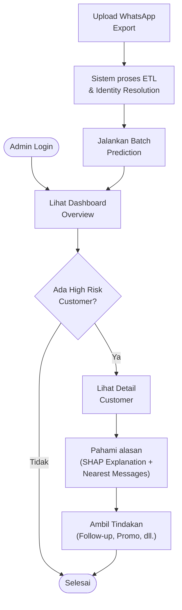

---

## 📝 Catatan Penting

### Separation of Concerns

1. **Training** dilakukan di **Jupyter Notebook** (terpisah, temporal proxy labels)
2. **Inference** dilakukan di **Flask Backend** (single trust boundary via `predict_for_customer`)
3. **Dashboard** adalah **React Frontend**
4. **Feature config** terstruktur via `FeatureConfig` dataclass (bukan .env)

### Data Privacy

- Phone number di-hash sebelum disimpan
- Customer data bisa di-mask untuk display
- Consent tracking tersedia

### Model Versioning & Provenance

- Model artifacts memiliki hash untuk tracking
- Registry mencatat model aktif (`ml_model_registry`)
- Feature schema di-validate saat load (cross-service hash check)
- Setiap prediksi menyimpan **provenance**: model_hash, schema_hash, features_used, predicted_at
- SHAP explanations terikat ke model version tertentu

### Trust Boundary

- ML inference hanya melalui `MLService.predict_for_customer()`
- Features dibangun internally oleh `FeatureService.build_verified_features()` (pure, no side effects)
- Hanya data dari **verified** feedback links yang digunakan untuk ML
- External feature injection **dilarang** (method deprecated)

### Feature Engineering Principles

- Semua trend features menggunakan **smoothing** (SMA/EMA) untuk mengurangi noise
- **Interaction feature** menangkap bahwa penurunan pada user aktif lebih signifikan
- **CV (Coefficient of Variation)** menormalisasi volatilitas terhadap activity level
- User dormant (activity ≈ 0) → CV = 0, bukan infinite (dormant ≠ volatile)

---

_Dokumentasi ini terakhir diperbarui: April 2026_
_Versi Sistem: v3.0.0_
_Feature Schema: 20 features (Trend + Context + Magnitude + Volatility + Interaction + NLP)_
