# 📘 Dokumentasi Sistem Prediksi Customer Churn - Mamina Baby Spa

## 📋 Daftar Isi

1. [Gambaran Umum Sistem](#1-gambaran-umum-sistem)
2. [Arsitektur Sistem](#2-arsitektur-sistem)
3. [Diagram Alur Data](#3-diagram-alur-data)
4. [Komponen Utama](#4-komponen-utama)
5. [Alur Data Detail](#5-alur-data-detail)
6. [Struktur Database](#6-struktur-database)
7. [API Endpoints](#7-api-endpoints)
8. [Alur Proses Bisnis](#8-alur-proses-bisnis)

---

## 1. Gambaran Umum Sistem

Sistem ini adalah aplikasi **Customer Churn Prediction** untuk **Mamina Baby Spa & Pijat Laktasi**. Sistem menggunakan Machine Learning untuk memprediksi kemungkinan customer berhenti menggunakan layanan (churn).

### Fitur Utama:

- ✅ Prediksi risiko churn customer menggunakan XGBoost
- ✅ Explainability dengan SHAP values
- ✅ ETL data dari WhatsApp chat logs
- ✅ Dashboard real-time untuk monitoring

---

## 2. Arsitektur Sistem

### 2.1 Arsitektur High-Level

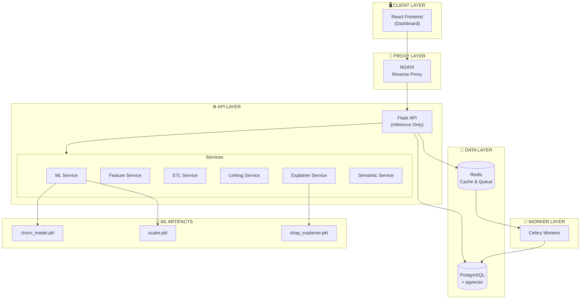

### 2.2 Tech Stack

| Layer           | Teknologi                    |
| --------------- | ---------------------------- |
| Frontend        | React 18, Tailwind CSS, Vite |
| Backend         | Flask, SQLAlchemy, Flasgger  |
| Database        | PostgreSQL + pgvector        |
| Cache/Queue     | Redis                        |
| Background Jobs | Celery                       |
| ML              | XGBoost, SHAP, scikit-learn  |
| Auth            | JWT (Flask-JWT-Extended)     |

---

## 3. Diagram Alur Data

### 3.1 Alur Data Utama (End-to-End)

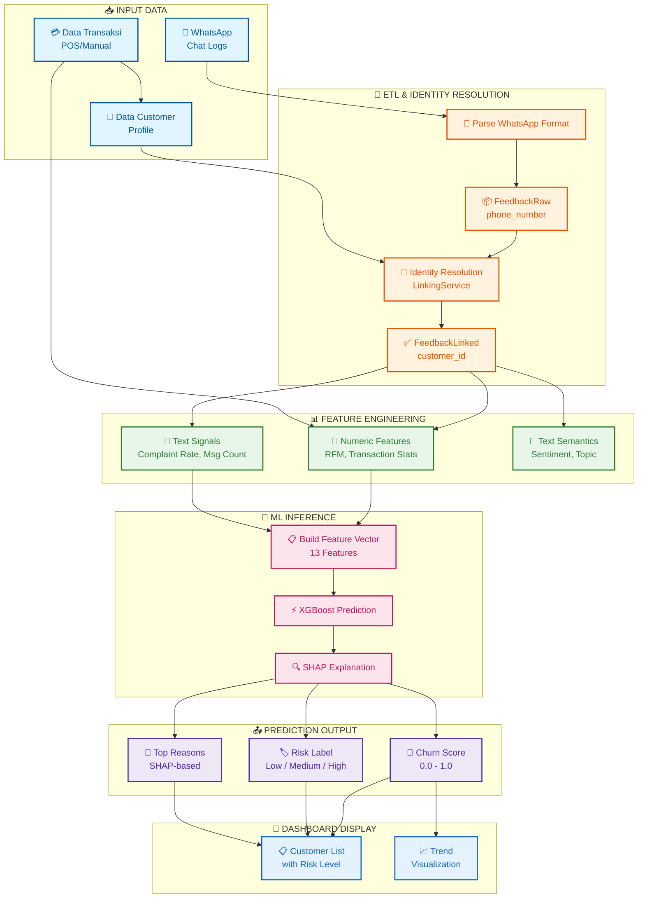

### 3.2 Alur ETL WhatsApp

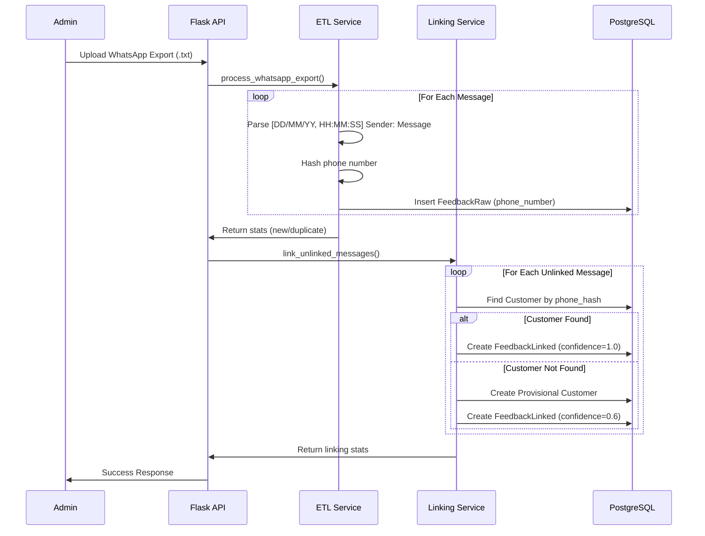

### 3.3 Alur Prediksi Churn

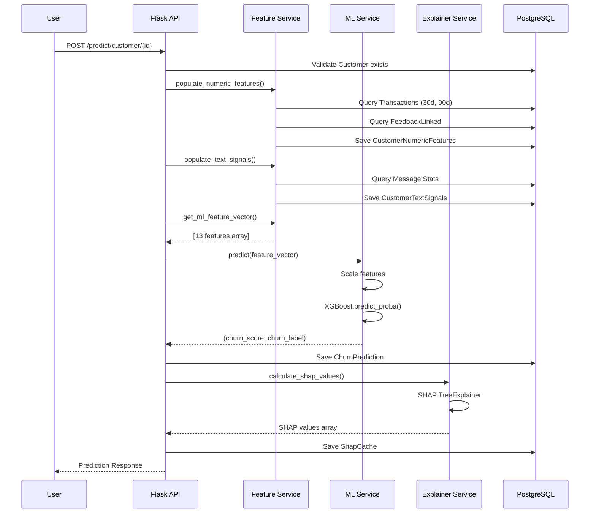

### 3.4 Alur Feature Engineering

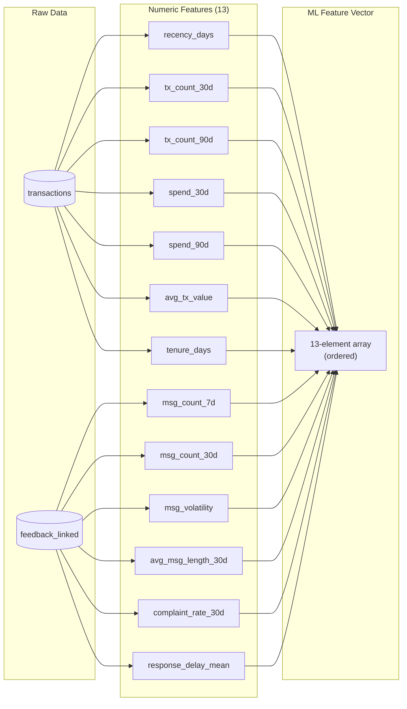

---

## 4. Komponen Utama

### 4.1 Backend Services

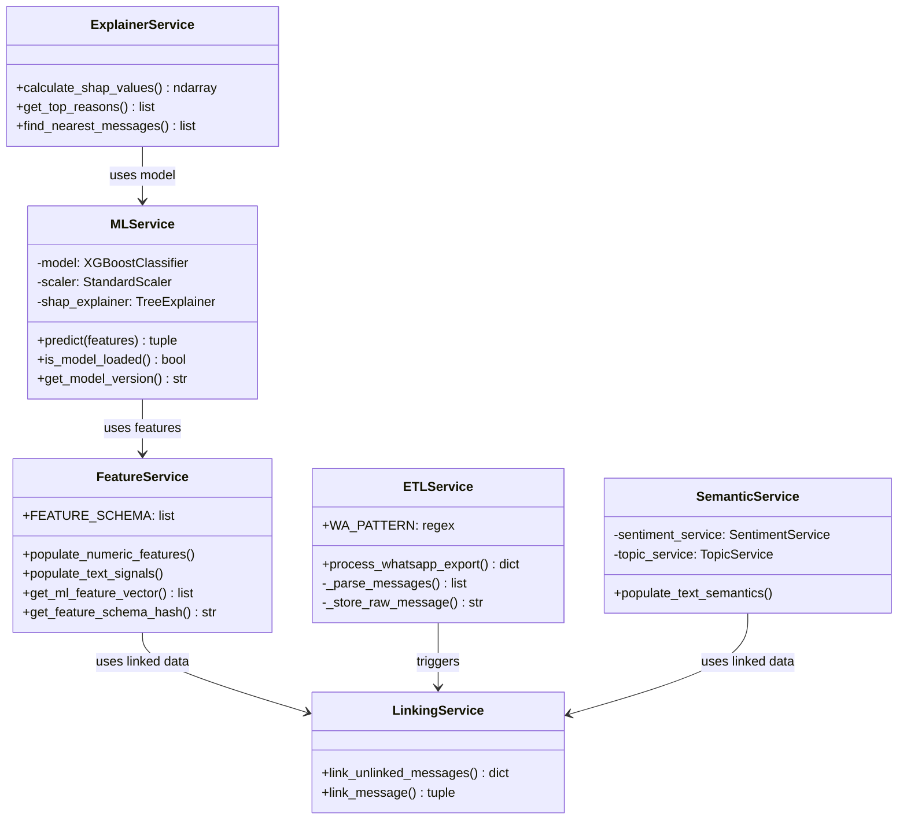

### 4.2 Database Models

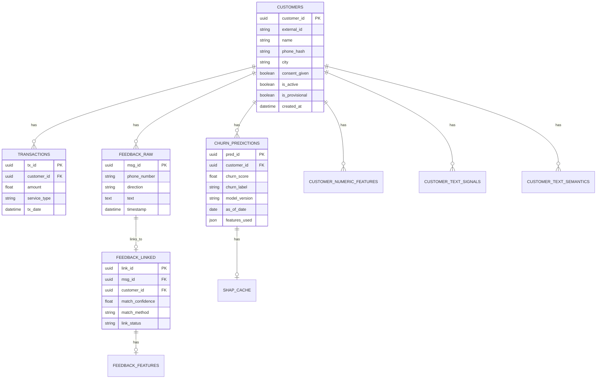

---

## 5. Alur Data Detail

### 5.1 Data Flow Layers

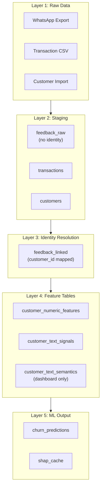

### 5.2 Identity Resolution Flow

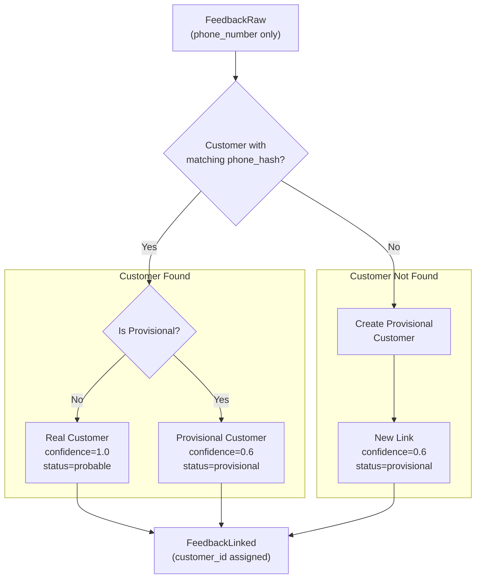

### 5.3 ML Pipeline Flow

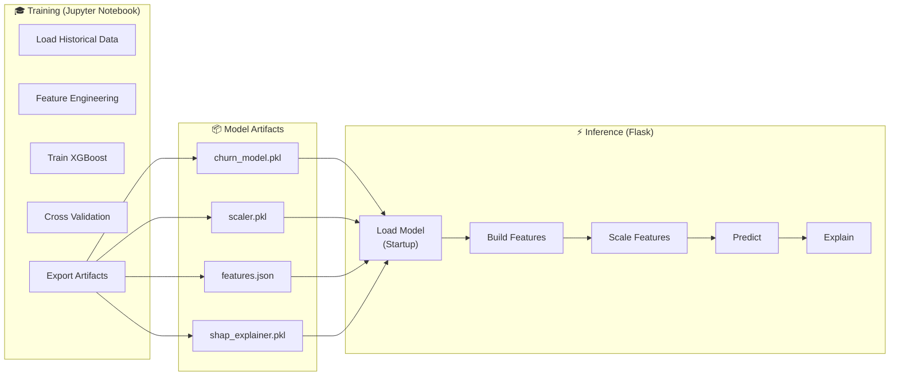

---

## 6. Struktur Database

### 6.1 Schema Overview

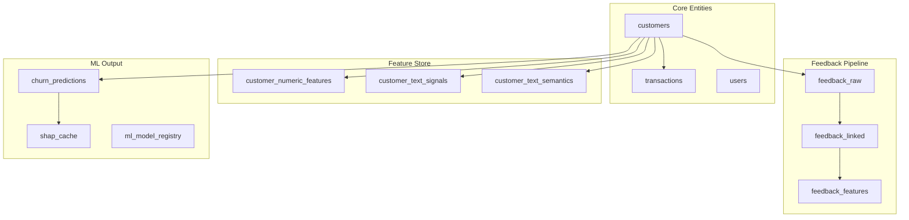

### 6.2 Tabel Utama

| Tabel                       | Deskripsi                            | Layer     |
| --------------------------- | ------------------------------------ | --------- |
| `customers`                 | Data profil customer                 | Core      |
| `transactions`              | Riwayat transaksi                    | Core      |
| `feedback_raw`              | Pesan WhatsApp mentah                | Staging   |
| `feedback_linked`           | Pesan yang sudah di-link ke customer | Identity  |
| `customer_numeric_features` | Fitur numerik untuk ML               | Feature   |
| `customer_text_signals`     | Sinyal teks (stats)                  | Feature   |
| `customer_text_semantics`   | Semantik teks (dashboard only)       | Display   |
| `churn_predictions`         | Hasil prediksi                       | ML Output |
| `shap_cache`                | Cache SHAP values                    | ML Output |

---

## 7. API Endpoints

### 7.1 Endpoint Overview

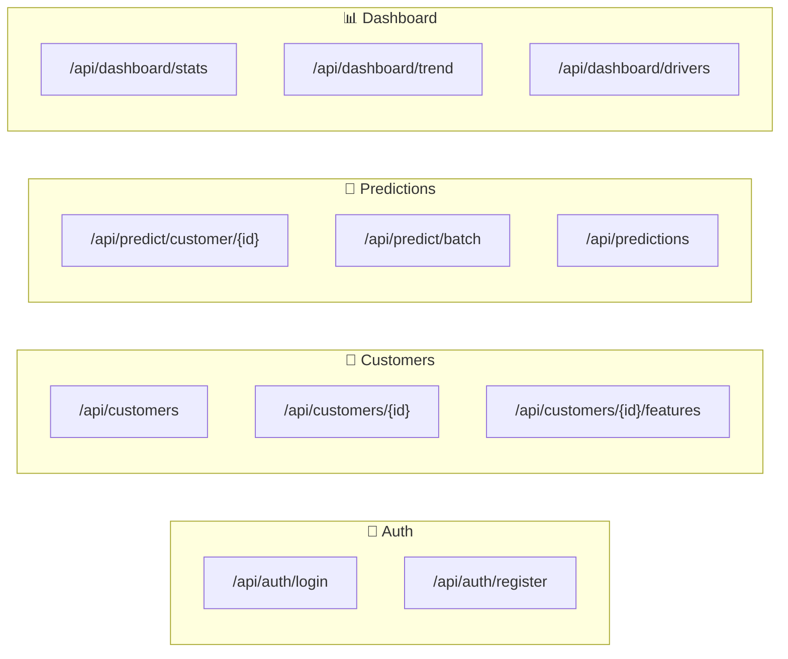

### 7.2 Endpoint Details

| Method | Endpoint                     | Deskripsi              |
| ------ | ---------------------------- | ---------------------- |
| POST   | `/api/auth/login`            | Login user             |
| GET    | `/api/customers`             | List semua customer    |
| GET    | `/api/customers/{id}`        | Detail customer        |
| POST   | `/api/predict/customer/{id}` | Prediksi satu customer |
| POST   | `/api/predict/batch`         | Prediksi batch         |
| GET    | `/api/predictions`           | List prediksi          |
| GET    | `/api/dashboard/stats`       | Statistik dashboard    |
| GET    | `/api/dashboard/trend`       | Trend churn            |

---

## 8. Alur Proses Bisnis

### 8.1 Workflow Pengguna

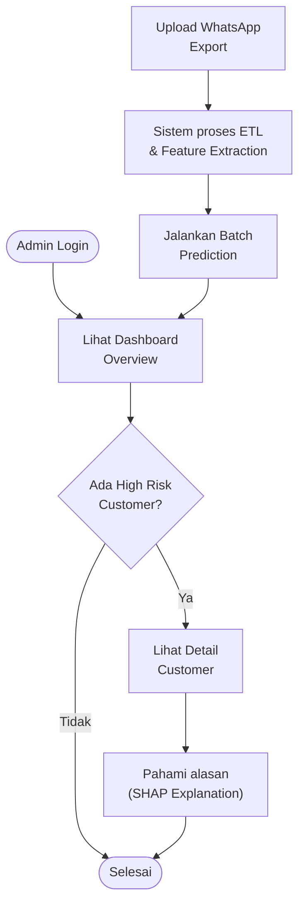

---

## 📝 Catatan Penting

### Separation of Concerns

1. **Training** dilakukan di **Jupyter Notebook** (terpisah)
2. **Inference** dilakukan di **Flask Backend**
3. **Dashboard** adalah **React Frontend**

### Data Privacy

- Phone number di-hash sebelum disimpan
- Customer data bisa di-mask untuk display
- Consent tracking tersedia

### Model Versioning

- Model artifacts memiliki hash untuk tracking
- Registry mencatat model aktif
- Feature schema di-validate saat load

---

_Dokumentasi ini dibuat pada: Januari 2026_
_Versi: 1.0_
